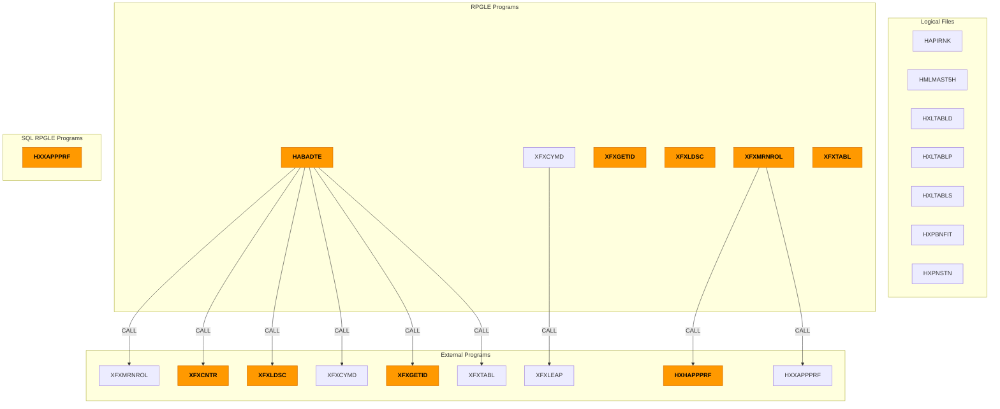

# Dependency Graph — HABADTE (run 202606260730)

```mermaid
%%{init: {'theme': 'default', 'flowchart': {'rankSpacing': 80, 'nodeSpacing': 50, 'curve': 'basis'}}}%%
flowchart TD
    subgraph DDS_LF["Logical Files"]
        HAPIRNK["HAPIRNK"]
        HMLMAST5H["HMLMAST5H"]
        HXLTABLD["HXLTABLD"]
        HXLTABLP["HXLTABLP"]
        HXLTABLS["HXLTABLS"]
        HXPBNFIT["HXPBNFIT"]
        HXPNSTN["HXPNSTN"]
    end

    subgraph PROGRAM["External Programs"]
        _HXHAPPPRF_["HXHAPPPRF"]:::hotspot
        _HXXAPPPRF_["HXXAPPPRF"]
        _XFXCNTR_["XFXCNTR"]:::hotspot
        _XFXCYMD_["XFXCYMD"]
        _XFXGETID_["XFXGETID"]:::hotspot
        _XFXLDSC_["XFXLDSC"]:::hotspot
        _XFXLEAP_["XFXLEAP"]
        _XFXMRNROL_["XFXMRNROL"]
        _XFXTABL_["XFXTABL"]
    end

    subgraph RPGLE["RPGLE Programs"]
        HABADTE["HABADTE"]:::hotspot
        XFXCYMD["XFXCYMD"]
        XFXGETID["XFXGETID"]:::hotspot
        XFXLDSC["XFXLDSC"]:::hotspot
        XFXMRNROL["XFXMRNROL"]:::hotspot
        XFXTABL["XFXTABL"]:::hotspot
    end

    subgraph SQLRPGLE["SQL RPGLE Programs"]
        HXXAPPPRF["HXXAPPPRF"]:::hotspot
    end

    classDef hotspot fill:#ff9900,stroke:#cc6600,color:#000,font-weight:bold

    XFXCYMD -->|CALL| _XFXLEAP_
    XFXMRNROL -->|CALL| _HXHAPPPRF_
    XFXMRNROL -->|CALL| _HXXAPPPRF_
    HABADTE -->|CALL| _XFXMRNROL_
    HABADTE -->|CALL| _XFXCNTR_
    HABADTE -->|CALL| _XFXLDSC_
    HABADTE -->|CALL| _XFXCYMD_
    HABADTE -->|CALL| _XFXGETID_
    HABADTE -->|CALL| _XFXTABL_
```
