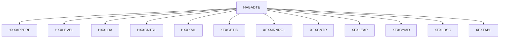
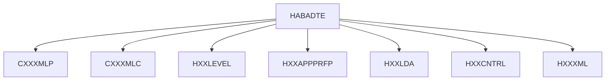
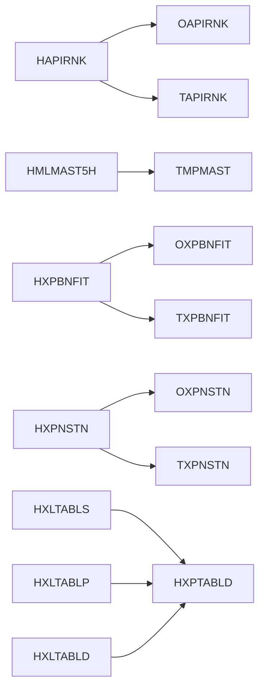
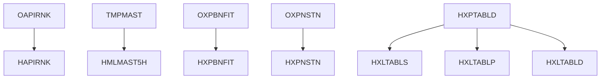

# AS400 Code Analysis Report — HABADTE

## Section 1 — Component Inventory

### 1.1 Source Members by Folder

| Folder | Member      | Type      | Description |
|--------|-------------|-----------|-------------|
| main program | HABADTE.RPGLE | RPGLE | Main orchestrator for HABADTE processing, drives patient management batch logic. |
| copysrc | CXXXMLP.SQLRPGLE | SQLRPGLE | Copy / support routine for XML processing and parameter handling. |
| copysrc | HXXLEVEL.RPGLE | RPGLE | Copy member providing organizational level lookup and mappings (levels 1–6). |
| copysrc | HXXAPPPRFP.RPGLE | RPGLE | Copy member for application preferences profile; encapsulates preference retrieval rules. |
| copysrc | HXXLDA.RPGLE | RPGLE | Copy member managing LDA (Local Data Area) initialization and context. |
| copysrc | HXXCNTRL.RPGLE | RPGLE | Copy member for control data, run flags, and high-level batch control structures. |
| copysrc | HXXXML.RPGLE | RPGLE | Copy member for XML marshalling/unmarshalling helpers. |
| called programs | HXXAPPPRF.SQLRPGLE | SQLRPGLE | Application preference service; resolves preference values with override logic. |
| called programs | XFXGETID.RPGLE | RPGLE | Utility for generating or retrieving unique identifiers. |
| called programs | XFXMRNROL.RPGLE | RPGLE | Utility for MRN (Medical Record Number) role or status evaluation. |
| called programs | XFXCNTR.RPGLE | RPGLE | Counter utility implementing range-based branching (BR-001, BR-002). |
| called programs | XFXLEAP.RPGLE | RPGLE | Utility to determine leap year / date characteristics. |
| called programs | XFXCYMD.RPGLE | RPGLE | Date validation and conversion utility (CYMD handling, BR-003–BR-008). |
| called programs | XFXLDSC.RPGLE | RPGLE | LDA map validation and description utility (BR-009–BR-012). |
| called programs | XFXTABL.RPGLE | RPGLE | Table-driven indicator-based branching utility (BR-013–BR-016). |
| called programs | XFXLDSC.RPGLE | RPGLE | LDA mapping and validation utility. |
| called programs | XFXTABL.RPGLE | RPGLE | Table/indicator driven branching utility. |
| File definitions | HAPTRFR.PF | DDS_PF | Transfer file containing account and MRN information (PHI). |
| File definitions | HAPIRNK.LF | DDS_LF | Logical file over TAPIRNK, used for rank/priority of accounts. |
| File definitions | HMLMAST5H.LF | DDS_LF | Logical file over TMPMAST (missing physical), high-impact for HABADTE. |
| File definitions | HXPXMLR.PF | DDS_PF | XML request/response repository for HABADTE processing. |
| File definitions | HXLTABLS.LF | DDS_LF | Logical file over HXPTABLD/HXLTABLD for status/lookup tables. |
| File definitions | HXLTABLP.LF | DDS_LF | Logical file providing preference/level-based table lookups. |
| File definitions | HXLTABLD.LF | DDS_LF | Logical file over HXPTABLD for dictionary/lookup data. |
| File definitions | HXPTABLD.PF | DDS_PF | Base physical file for table/lookup definitions. |
| File definitions | HXPXMLD.PF | DDS_PF | XML dictionary / definition file for HABADTE messages. |
| File definitions | HXPLVL1.PF | DDS_PF | Org level 1 table (e.g., enterprise/region). |
| File definitions | HXPLVL2.PF | DDS_PF | Org level 2 table. |
| File definitions | HXPLVL3.PF | DDS_PF | Org level 3 table. |
| File definitions | HXPLVL4.PF | DDS_PF | Org level 4 table (isolated node in dependency graph). |
| File definitions | HXPLVL5.PF | DDS_PF | Org level 5 table. |
| File definitions | HXPLVL6.PF | DDS_PF | Org level 6 table. |
| File definitions | HXPNSTN.LF | DDS_LF | Logical file over TXPNSTN (missing PF) for institution/location codes. |
| File definitions | HXPBNFIT.LF | DDS_LF | Logical file over TXPBNFIT (missing PF) for benefit codes. |
| File definitions | OAPIRNK.PF | DDS_PF | Physical file for rank/priority; contains PHI fields. |
| File definitions | OMPMAST.PF | DDS_PF | Master patient/account file (PHI-heavy). |
| File definitions | OXPBNFIT.PF | DDS_PF | Benefit file containing telephone/contact PHI. |
| File definitions | OXPNSTN.PF | DDS_PF | Institution/location physical file. |
| File definitions | HXPDICT.PF | DDS_PF | Dictionary mapping MRN, phone, and name fields (PHI). |
| File definitions | TAPIRNK.txt | EXTERNAL | Missing external file referenced by HAPIRNK logical file. |
| File definitions | TMPMAST.txt | EXTERNAL | Missing external file referenced by HMLMAST5H logical file. |
| File definitions | TXPBNFIT.txt | EXTERNAL | Missing external file referenced by HXPBNFIT logical file. |
| File definitions | TXPNSTN.txt | EXTERNAL | Missing external file referenced by HXPNSTN logical file. |

### 1.2 Totals by Type

Based on the source manifest and directory listing:

| Type        | Count |
|-------------|-------|
| RPGLE       | 13    |
| SQLRPGLE    | 2     |
| DDS_PF      | 15    |
| DDS_LF      | 7     |
| EXTERNAL TXT| 4     |
| **Total**   | **41** |

(Note: The manifest summary reports 37 members; the additional TXT entries represent external/missing PFs modelled as text definitions.)

---

## Section 2 — Missing Components

The gap report identifies several missing or unresolved components that are referenced by the harvested source.

### 2.1 Missing Programs

| Program     | Impact  | Referenced By |
|-------------|---------|---------------|
| HXHAPPPRF   | MEDIUM  | XFXMRNROL     |

These missing programs may encapsulate preference application logic or additional workflow orchestration. Their absence primarily affects interpretability and test completeness rather than basic compilation.

### 2.2 Missing Copy Members

| Copy Member | Impact | Referenced By |
|-------------|--------|---------------|
| CXXXMLC     | HIGH   | HABADTE       |

CXXXMLC is a high-impact copybook referenced by the HABADTE main program. It likely contains XML layout, parsing, or common routines. Missing definitions may hide business rules related to XML interface validation and mapping.

### 2.3 Missing Data Areas

No data areas are reported as missing in the current gap report. All referenced data areas appear to be either implicit (*LDA) or standard system data areas.

### 2.4 Missing Referenced Files

| File       | Impact  | Referenced By |
|------------|---------|---------------|
| TAPIRNK    | HIGH    | HAPIRNK       |
| TMPMAST    | HIGH    | HMLMAST5H     |
| TXPBNFIT   | HIGH    | HXPBNFIT      |
| TXPNSTN    | HIGH    | HXPNSTN       |
| ****HXPXML | MEDIUM  | HABADTE       |
| PRINTER    | MEDIUM  | HABADTE       |

These missing files are critical for reconstructing full data lineage and for validating filter/enrichment rules that depend on external rank, master, benefit, institution, XML, and printer/output resources.

---

## Section 3 — Duplicate Components

### 3.1 Duplicate Record Formats (LF Reusing PF Format Source)

Across the HABADTE domain, several logical files reuse record formats from their underlying physical files:

| Logical File | Physical File | Format Source | Notes |
|--------------|---------------|---------------|-------|
| HAPIRNK.LF   | OAPIRNK.PF / TAPIRNK | OAPIRNK | Rank/priority logical view over base rank PF; same record format reused for different key sequences. |
| HMLMAST5H.LF | TMPMAST (missing) | TMPMAST | Logical view over master patient file, likely filtered on HABADTE-specific criteria. |
| HXPBNFIT.LF  | OXPBNFIT.PF / TXPBNFIT | OXPBNFIT | Logical view for benefit codes; format reuse suggests direct pass-through of base PF fields. |
| HXPNSTN.LF   | OXPNSTN.PF / TXPNSTN | OXPNSTN | Logical view for institution/location codes. |
| HXLTABLS.LF  | HXPTABLD.PF | HXPTABLD | Logical status/lookup view using the base table definition format. |
| HXLTABLP.LF  | HXPTABLD.PF | HXPTABLD | Preference/level-based view reusing the same base format. |
| HXLTABLD.LF  | HXPTABLD.PF | HXPTABLD | Alternate key sequence or filtered view over the same table definition PF. |

This reuse is intentional and typical in DDS design. It implies that changes to PF formats propagate to all dependent LFs.

### 3.2 Duplicate Field Declarations

The PHI registry highlights several fields that appear across multiple files:

| Field   | Files                                        | Notes |
|---------|----------------------------------------------|-------|
| AFACCT  | HAPTRFR                                     | Account number; likely duplicates in OMPMAST/other PFs not explicitly listed. |
| AFMRNO  | HAPTRFR                                     | Medical record number; appears in multiple PHI-bearing files. |
| MMMRNO  | OMPMAST                                     | MRN in master patient file. |
| MMACCT  | OMPMAST                                     | Account in master patient file. |
| MMNAME  | OMPMAST                                     | Patient name. |
| MMPSSN  | OMPMAST                                     | Social Security Number or equivalent identifier. |
| CCMRNO  | HXPDICT                                     | Cross-reference MRN; dictionary mapping to other identifiers. |
| XCNAME  | HXPDICT                                     | Cross-reference name. |
| XFBTEL  | OXPBNFIT, HXPDICT                           | Telephone number; appears in benefit and dictionary files. |
| HXRMNO  | HXPDICT                                     | HABADTE-related MRN or record key. |

These duplicate fields must be handled consistently in the migration, with shared data types and masking/anonymization policies.

### 3.3 Legacy PF + SQL Table Pairs

Although explicit SQL table artifacts are not provided, the following PFs are strong candidates for direct SQL Server tables in the target architecture:

| PF        | Likely SQL Table         | Notes |
|-----------|--------------------------|-------|
| OMPMAST   | HABADTE_PatientMaster    | Core master patient/account table with PHI. |
| OAPIRNK   | HABADTE_AccountRank      | Rank/priority table for accounts. |
| OXPBNFIT  | HABADTE_Benefit          | Benefit definitions and PHI contact data. |
| OXPNSTN   | HABADTE_Institution      | Institution/location master. |
| HXPDICT   | HABADTE_Dictionary       | Dictionary/cross-reference table for MRN, phone, and name mappings. |
| HXPTABLD  | HABADTE_LookupTableDef   | Generic lookup/table definition repository. |
| HAPTRFR   | HABADTE_Transfer         | Transfer/transaction table linking accounts and MRNs. |

---

## Section 4 — Dependency Analysis

### 4.1 Program Call Chain

Based on the dependency graph and interpretations:

| Caller   | Callee        | Type    | Notes |
|----------|---------------|---------|-------|
| HABADTE  | HXXAPPPRF     | SQLRPGLE| Application preference lookup (preference profile resolution). |
| HABADTE  | HXXLEVEL      | RPGLE   | Org level mapping and hierarchy resolution. |
| HABADTE  | HXXLDA        | RPGLE   | LDA initialization and context management. |
| HABADTE  | HXXCNTRL      | RPGLE   | Control data and batch flags. |
| HABADTE  | HXXXML        | RPGLE   | XML helper routines for HABADTE. |
| HABADTE  | XFXGETID      | RPGLE   | ID generation/retrieval during processing. |
| HABADTE  | XFXMRNROL     | RPGLE   | MRN role/status evaluation. |
| HABADTE  | XFXCNTR       | RPGLE   | Counter logic (BR-001, BR-002). |
| HABADTE  | XFXLEAP       | RPGLE   | Leap year/date-related logic. |
| HABADTE  | XFXCYMD       | RPGLE   | Date validation and conversion. |
| HABADTE  | XFXLDSC       | RPGLE   | LDA map validation. |
| HABADTE  | XFXTABL       | RPGLE   | Table-driven branching based on indicators. |

Utility programs (XFX*) are largely standalone but are orchestrated by HABADTE in the PATIENT_MANAGEMENT domain.

### 4.2 File Usage by Program

| Program  | File / Object | Access Mode | Notes |
|----------|---------------|-------------|-------|
| HABADTE  | HAPTRFR       | Read/Update | Transfer records; PHI fields AFACCT, AFMRNO. |
| HABADTE  | OMPMAST       | Read        | Master patient/account data (MMMRNO, MMACCT, MMNAME, MMPSSN). |
| HABADTE  | OAPIRNK       | Read        | Account rank/priority. |
| HABADTE  | OXPBNFIT      | Read        | Benefit definitions and contact data. |
| HABADTE  | OXPNSTN       | Read        | Institution/location master. |
| HABADTE  | HXPDICT       | Read        | Dictionary mapping MRN/phone/name. |
| HABADTE  | HXPXMLD       | Read        | XML dictionary definitions. |
| HABADTE  | HXPXMLR       | Read/Write  | XML request/response repository. |
| HABADTE  | HXPTABLD      | Read        | Lookup table definitions. |
| HABADTE  | HXPLVL1–6     | Read        | Org level tables for hierarchy resolution. |
| HABADTE  | HAPIRNK       | Read        | Logical view over TAPIRNK/OAPIRNK. |
| HABADTE  | HMLMAST5H     | Read        | Logical view over TMPMAST for HABADTE-specific subset. |
| HABADTE  | HXLTABLS      | Read        | Status lookup table. |
| HABADTE  | HXLTABLP      | Read        | Preference/level-based lookup. |
| HABADTE  | HXLTABLD      | Read        | Alternate lookup view. |
| HABADTE  | PRINTER       | Write       | Spool/printer output file (missing definition). |
| XFX* utilities | HXPTABLD / HXLTABL* | Read | Table-driven configuration for counters, dates, and mappings. |

### 4.3 Copy Member Usage

| Copy Member | Used By | Purpose |
|-------------|---------|---------|
| CXXXMLP     | HABADTE | XML parameter and structure definitions. |
| CXXXMLC     | HABADTE | (Missing) XML common routines and layouts. |
| HXXLEVEL    | HABADTE | Org level hierarchy mapping (levels 1–6). |
| HXXAPPPRFP  | HABADTE | Application preference profile structures. |
| HXXLDA      | HABADTE | Local Data Area definitions and initialization. |
| HXXCNTRL    | HABADTE | Control record/flag definitions for batch runs. |
| HXXXML      | HABADTE | XML helper routines and constants. |

### 4.4 LF-to-PF Lineage

| Logical File | Physical File(s) | Key Characteristics |
|--------------|------------------|---------------------|
| HAPIRNK.LF   | OAPIRNK.PF / TAPIRNK | Rank/priority view; likely alternate sort order by rank or account. |
| HMLMAST5H.LF | TMPMAST (missing) | HABADTE-specific subset of master patient records. |
| HXPBNFIT.LF  | OXPBNFIT.PF / TXPBNFIT | Benefit view keyed by benefit codes and possibly institution. |
| HXPNSTN.LF   | OXPNSTN.PF / TXPNSTN | Institution/location view keyed by institution code. |
| HXLTABLS.LF  | HXPTABLD.PF | Status lookup view keyed by table ID/status code. |
| HXLTABLP.LF  | HXPTABLD.PF | Preference/level-based view keyed by table ID and level. |
| HXLTABLD.LF  | HXPTABLD.PF | Alternate key sequence or filtered view. |

### 4.5 REF() Dependencies

REF() in DDS is used to inherit formats from other files. In this codebase, REF() relationships are implicit in LF-to-PF lineage:

| File        | REF Source | Notes |
|-------------|------------|-------|
| HAPIRNK.LF  | OAPIRNK    | Logical file referencing base rank PF format. |
| HMLMAST5H.LF| TMPMAST    | Logical file referencing master PF format. |
| HXPBNFIT.LF | OXPBNFIT   | Logical file referencing benefit PF format. |
| HXPNSTN.LF  | OXPNSTN    | Logical file referencing institution PF format. |
| HXLTABLS.LF | HXPTABLD   | Logical file referencing table definition PF format. |
| HXLTABLP.LF | HXPTABLD   | Logical file referencing table definition PF format. |
| HXLTABLD.LF | HXPTABLD   | Logical file referencing table definition PF format. |

---

## Section 5 — Mermaid Dependency Graphs

The following Mermaid diagrams summarize key dependency views. They are conceptual and derived from the dependency graph artifact.

### 5.1 Program Call Hierarchy

### 5.2 Copy Member Dependencies

### 5.3 File Usage by HABADTE

```mermaid
flowchart TD
    HABADTE --> HAPTRFR
    HABADTE --> OMPMAST
    HABADTE --> OAPIRNK
    HABADTE --> OXPBNFIT
    HABADTE --> OXPNSTN
    HABADTE --> HXPDICT
    HABADTE --> HXPXMLD
    HABADTE --> HXPXMLR
    HABADTE --> HXPTABLD
    HABADTE --> HXPLVL1
    HABADTE --> HXPLVL2
    HABADTE --> HXPLVL3
    HABADTE --> HXPLVL4
    HABADTE --> HXPLVL5
    HABADTE --> HXPLVL6
    HABADTE --> HAPIRNK
    HABADTE --> HMLMAST5H
    HABADTE --> HXLTABLS
    HABADTE --> HXLTABLP
    HABADTE --> HXLTABLD
    HABADTE --> PRINTER
```

### 5.4 LF-to-PF Lineage

### 5.5 REF() Relationships

---

## Section 6 — Summary of Key Findings

### 6.1 Critical Issues

| Issue ID | Category        | Description | Impact |
|----------|-----------------|-------------|--------|
| CI-001   | Missing Copybook| CXXXMLC missing but referenced by HABADTE; XML layouts and rules may be incomplete. | High — XML interface behaviour cannot be fully validated. |
| CI-002   | Missing PF      | TAPIRNK/TMPMAST/TXPBNFIT/TXPNSTN missing; several LFs depend on them. | High — rank, master, benefit, and institution logic partially opaque. |
| CI-003   | PHI Exposure    | 22 PHI fields across 5 files (HAPTRFR, OXPBNFIT, OMPMAST, HXPDICT, OAPIRNK). | High — requires strict access control, masking, and audit in migration. |
| CI-004   | Printer Output  | PRINTER file missing definition; output/spooling behaviour unclear. | Medium — affects report generation and downstream integration. |
| CI-005   | Orphan Programs | Multiple XFX* utilities flagged as orphan but used logically by HABADTE. | Low/Medium — structural isolation but functionally integrated via calls. |

### 6.2 Architectural Observations

1. HABADTE is a central orchestrator with a high fan-out (13+ calls) to utility and preference/level services, indicating a hub-and-spoke batch architecture.
2. Data access is heavily table-driven: HXPTABLD and its logical derivatives (HXLTABLS, HXLTABLP, HXLTABLD) underpin preferences, statuses, and configuration.
3. PHI is concentrated in a small set of PFs (OMPMAST, HAPTRFR, OXPBNFIT, HXPDICT, OAPIRNK), making them priority targets for secure migration and masking.
4. Organizational hierarchy is represented across six distinct level PFs (HXPLVL1–HXPLVL6), suggesting flexible multi-level preference and routing logic.
5. Several logical files depend on missing external PFs (TAPIRNK, TMPMAST, TXPBNFIT, TXPNSTN), which must be reconciled with production exports before full modernization.
6. Utility programs (XFXCNTR, XFXCYMD, XFXLDSC, XFXTABL) encapsulate reusable business rules (BR-001–BR-016) that should be migrated as shared services in the target platform.
7. Overall dependency graph completeness is ~82.2%, sufficient for documentation and planning but not yet for full automated code transformation.
