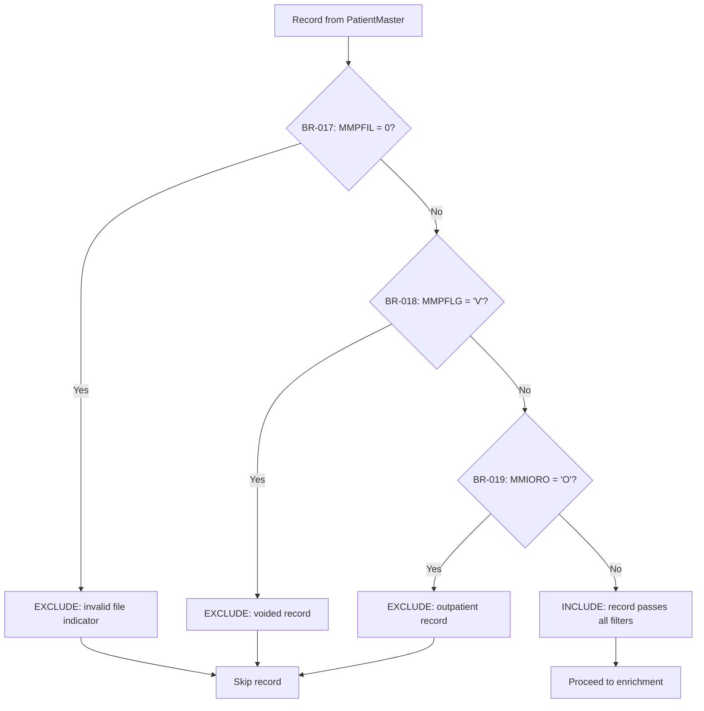
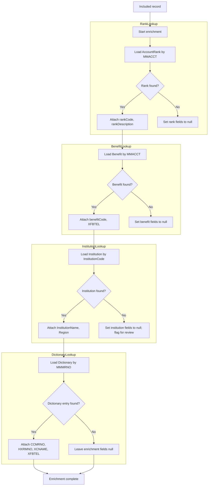
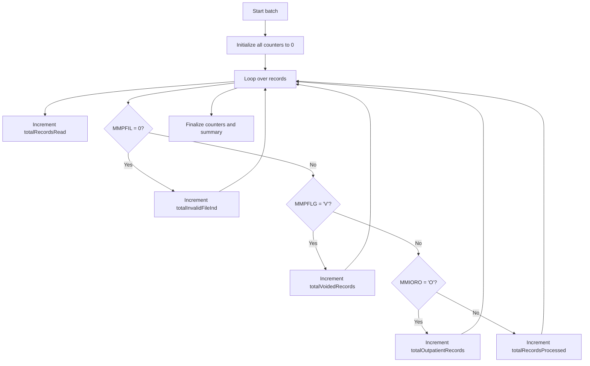
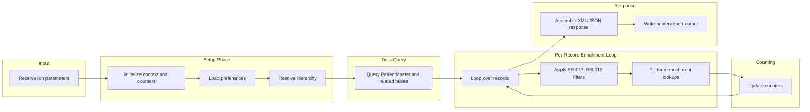

# Business Processing Flowcharts — HABADTE

## 1. Top-Level Processing Flow

```mermaid
flowchart TD
    START[[Start HABADTE Batch]] --> I1[Load run parameters]
    I1 --> I2[Initialize counters]
    I2 --> P1[Load preferences (HXXAPPPRF)]
    P1 --> C1[Resolve org hierarchy (HXPLVL1-6)]
    C1 --> Q1[Query PatientMaster and related tables]
    Q1 --> L1[Loop over records]
    L1 --> F1{BR-017: MMPFIL = 0?}
    F1 -->|Yes| SKIP1[Skip record; increment totalInvalidFileInd]
    F1 -->|No| F2{BR-018: MMPFLG = 'V'?}
    F2 -->|Yes| SKIP2[Skip record; increment totalVoidedRecords]
    F2 -->|No| F3{BR-019: MMIORO = 'O'?}
    F3 -->|Yes| SKIP3[Skip record; increment totalOutpatientRecords]
    F3 -->|No| E1[Enrich record (rank, benefit, institution, dictionary)]
    SKIP1 --> L1
    SKIP2 --> L1
    SKIP3 --> L1
    E1 --> CNT1[Increment totalRecordsProcessed]
    CNT1 --> L1
    L1 --> END[[End HABADTE Batch]]
```

## 2. Record Filter Gate



## 3. Data Enrichment Flow



## 4. Counter/Aggregation Logic



## 5. Application Preference Lookup Flow

```mermaid
flowchart TD
    P0[Start preference load] --> P1[Read base preferences from LookupTableDef]
    P1 --> P2[Determine org level (1-6) for run]
    P2 --> P3{Level-6 override available?}
    P3 -->|Yes| P4[Apply level-6 (department) override]
    P3 -->|No| P5{Level-5 override available?}
    P5 -->|Yes| P6[Apply level-5 (facility) override]
    P5 -->|No| P7{Level-4 override available?}
    P7 -->|Yes| P8[Apply level-4 (facility group) override]
    P7 -->|No| P9{Level-3 override available?}
    P9 -->|Yes| P10[Apply level-3 (network) override]
    P9 -->|No| P11{Level-2 override available?}
    P11 -->|Yes| P12[Apply level-2 (region) override]
    P11 -->|No| P13{Level-1 override available?}
    P13 -->|Yes| P14[Apply level-1 (enterprise) override]
    P13 -->|No| P15[Use base preference]

    P4 --> PEND[Preference context ready]
    P6 --> PEND
    P8 --> PEND
    P10 --> PEND
    P12 --> PEND
    P14 --> PEND
    P15 --> PEND
```

## 6. Org/Hierarchy Level Lookup Flow

```mermaid
flowchart TD
    H0[Start hierarchy resolution] --> H1{Determine current level key}
    H1 --> L1[Lookup in HXPLVL1 (Enterprise)]
    H1 --> L2[Lookup in HXPLVL2 (Region)]
    H1 --> L3[Lookup in HXPLVL3 (Network)]
    H1 --> L4[Lookup in HXPLVL4 (Facility Group)]
    H1 --> L5[Lookup in HXPLVL5 (Facility)]
    H1 --> L6[Lookup in HXPLVL6 (Department/Unit)]

    L1 --> R1{Found?}
    L2 --> R2{Found?}
    L3 --> R3{Found?}
    L4 --> R4{Found?}
    L5 --> R5{Found?}
    L6 --> R6{Found?}

    R1 -->|Yes| H2[Attach enterprise context]
    R1 -->|No| H3[Default enterprise]
    R2 -->|Yes| H4[Attach region context]
    R2 -->|No| H5[Default region]
    R3 -->|Yes| H6[Attach network context]
    R3 -->|No| H7[Default network]
    R4 -->|Yes| H8[Attach facility group context]
    R4 -->|No| H9[Default facility group]
    R5 -->|Yes| H10[Attach facility context]
    R5 -->|No| H11[Default facility]
    R6 -->|Yes| H12[Attach department context]
    R6 -->|No| H13[Default department]

    H2 --> HEND[Hierarchy context ready]
    H4 --> HEND
    H6 --> HEND
    H8 --> HEND
    H10 --> HEND
    H12 --> HEND
    H3 --> HEND
    H5 --> HEND
    H7 --> HEND
    H9 --> HEND
    H11 --> HEND
    H13 --> HEND
```

## 7. End-to-End Summary Flow


