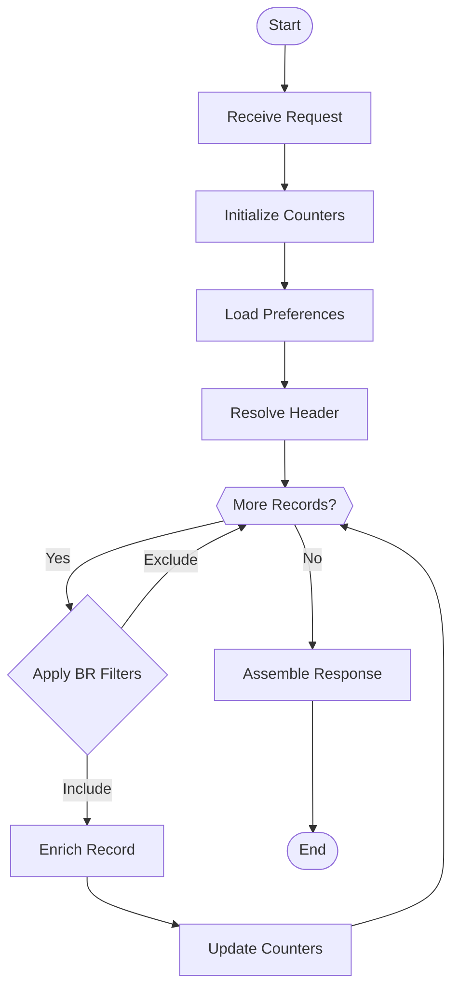
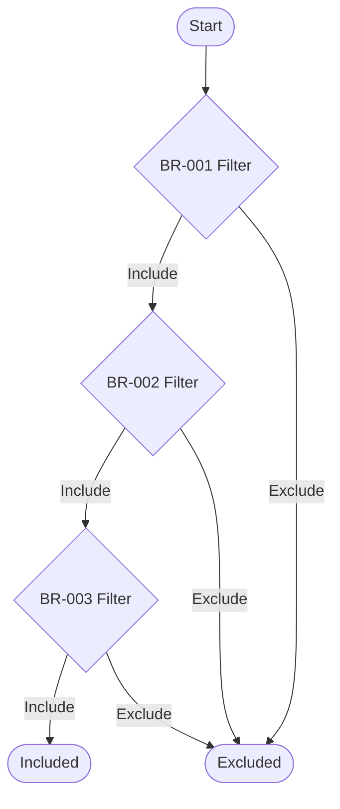
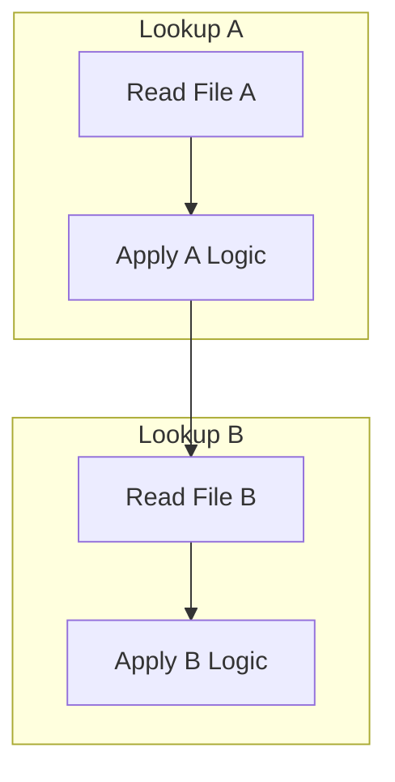
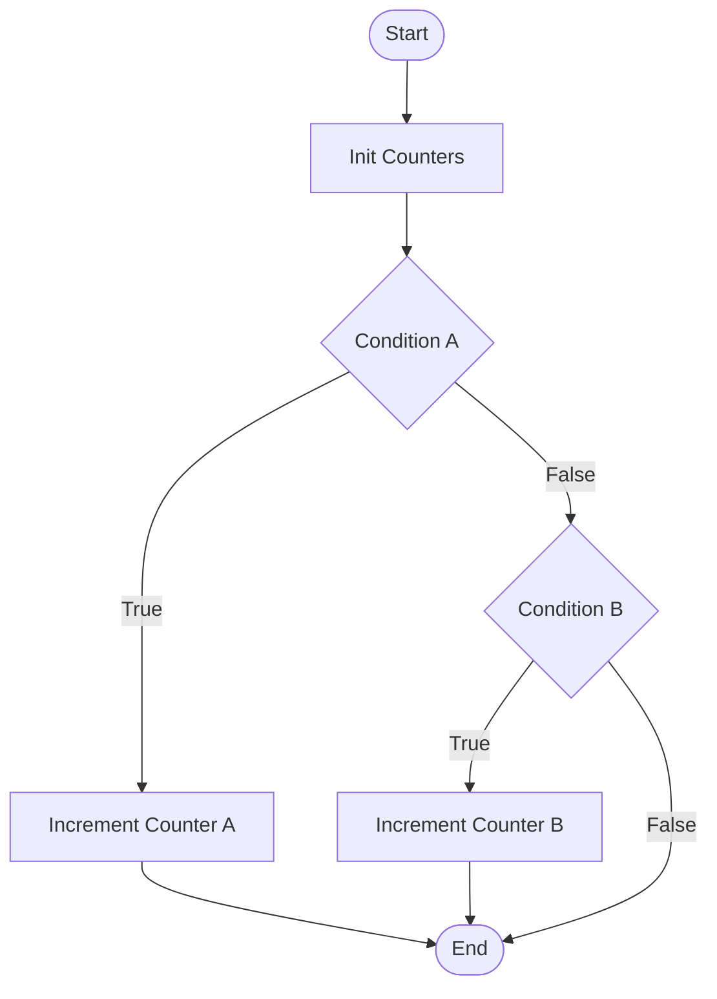
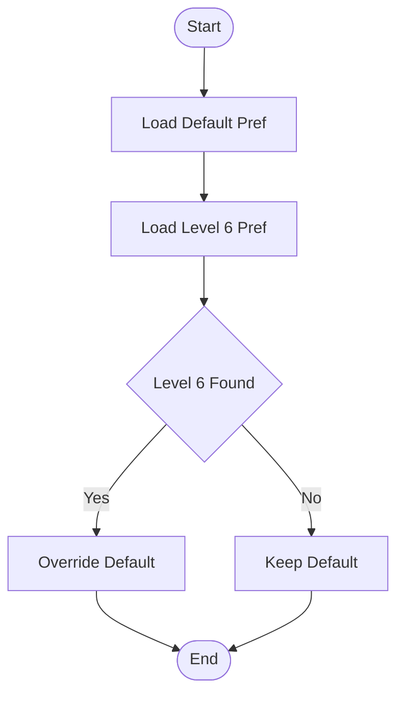
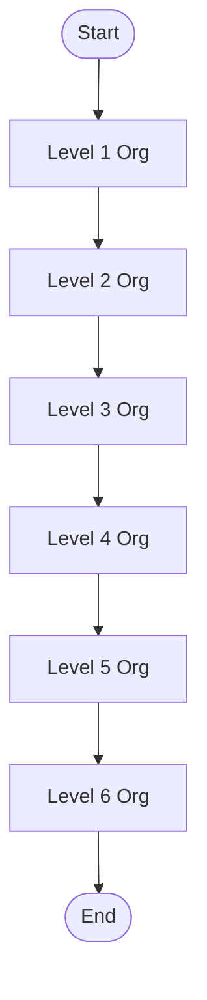
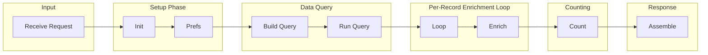

# Business Processing Flowchart

```mermaid
flowchart TD
    START([Start]) --> INPUT[Receive Request]
    INPUT --> INIT[Initialize Counters]
    INIT --> PREFS[Load Preferences]
    PREFS --> HDR[Resolve Header]
    HDR --> LOOP{{More Records?}}
    LOOP -->|Yes| BRDECIDE{Apply BR Filters}
    BRDECIDE -->|Include| ENRICH[Enrich Record]
    BRDECIDE -->|Exclude| LOOP
    ENRICH --> COUNT[Update Counters]
    COUNT --> LOOP
    LOOP -->|No| RESP[Assemble Response]
    RESP --> END([End])
```

```mermaid
flowchart TD
    START([Start]) --> F1{BR-001 Filter}
    F1 -->|Include| F2{BR-002 Filter}
    F1 -->|Exclude| END([Excluded])
    F2 -->|Include| F3{BR-003 Filter}
    F2 -->|Exclude| END
    F3 -->|Include| PASS([Included])
    F3 -->|Exclude| END
```

```mermaid
flowchart TD
    subgraph "Lookup A"
        LA1[Read File A]
        LA2[Apply A Logic]
        LA1 --> LA2
    end

    subgraph "Lookup B"
        LB1[Read File B]
        LB2[Apply B Logic]
        LB1 --> LB2
    end

    LA2 --> LB1
```

```mermaid
flowchart TD
    CSTART([Start]) --> C1[Init Counters]
    C1 --> C2{Condition A}
    C2 -->|True| CA[Increment Counter A]
    C2 -->|False| C3{Condition B}
    C3 -->|True| CB[Increment Counter B]
    C3 -->|False| CEND([End])
    CA --> CEND
    CB --> CEND
```

```mermaid
flowchart TD
    PSTART([Start]) --> P1[Load Default Pref]
    P1 --> P2[Load Level 6 Pref]
    P2 --> P3{Level 6 Found}
    P3 -->|Yes| P4[Override Default]
    P3 -->|No| P5[Keep Default]
    P4 --> PEND([End])
    P5 --> PEND
```

```mermaid
flowchart TD
    OSTART([Start]) --> L1[Level 1 Org]
    L1 --> L2[Level 2 Org]
    L2 --> L3[Level 3 Org]
    L3 --> L4[Level 4 Org]
    L4 --> L5[Level 5 Org]
    L5 --> L6[Level 6 Org]
    L6 --> OEND([End])
```

```mermaid
flowchart LR
    subgraph Input
        I1[Receive Request]
    end

    subgraph "Setup Phase"
        S1[Init]
        S2[Prefs]
        S1 --> S2
    end

    subgraph "Data Query"
        Q1[Build Query]
        Q2[Run Query]
        Q1 --> Q2
    end

    subgraph "Per-Record Enrichment Loop"
        E1[Loop]
        E2[Enrich]
        E1 --> E2
    end

    subgraph Counting
        C1[Count]
    end

    subgraph Response
        R1[Assemble]
    end

    I1 --> S1
    S2 --> Q1
    Q2 --> E1
    E2 --> C1
    C1 --> R1
```
