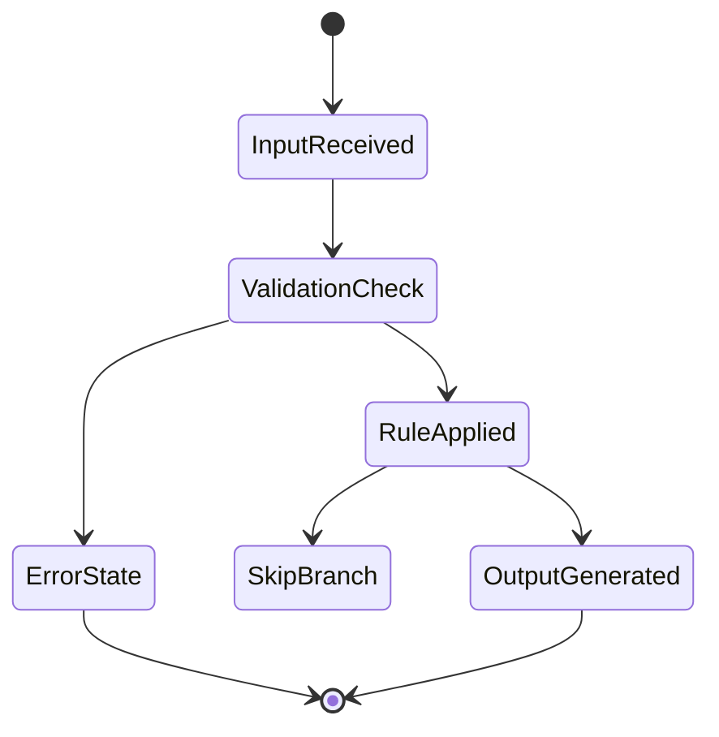
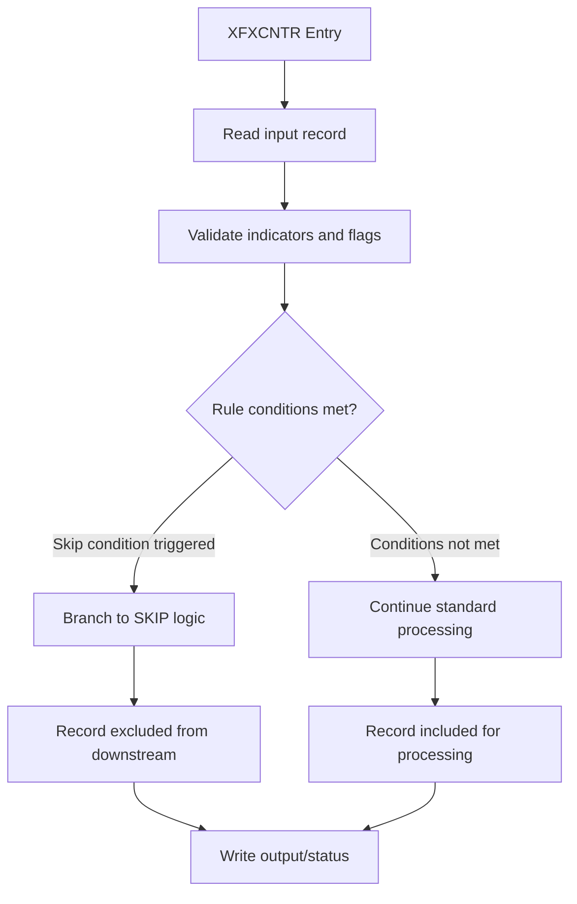

# HABADTE Business Requirements Document | v1.0 DRAFT | Run: 202607010802

## 1. Executive Summary

AS400 RPG legacy system managing patient data, benefit processing, enrollment, and date/table utility functions for healthcare operations.. The analyzed scope includes 19 approved business rules across 2 domain(s), implemented in 5 program(s). This BRD documents approved rules and their traceable implementations.

## 2. Stakeholder Matrix

| Role | Responsibilities | Access |
|------|-----------------|--------|
| AS400 Operator | Run batch jobs, monitor queues, handle operational issues. | Operational consoles, job logs. |
| End User | Use modernized application to manage business records. | Application UI/API. |
| Business Analyst | Define and validate business rules and reporting needs. | Requirements tools, BRD. |
| Mainframe SME | Interpret legacy RPG logic and confirm functional equivalence. | Source code, technical docs. |
| Compliance Officer | Ensure PHI and regulatory requirements are met. | PHI reports, audit logs. |
| Solution Architect | Design target architecture and integration patterns. | Architecture diagrams, APIs. |
| Quality Lead | Own test strategy, coverage, and defect management. | Test plans, QA reports. |

## 3. Business Rules

| Rule ID | Name (5 words) | Logic | Program | Edge Cases |
|--------|----------------|-------|---------|------------|
| BR-001 | When X equals zero branch to EXIT | When X equals zero branch to EXIT | XFXCNTR | Rule applies on match condition. |
| BR-002 | When X equals 40 branch to EXIT | When X equals 40 branch to EXIT | XFXCNTR | Rule applies on match condition. |
| BR-003 | When VYY is less than 1800 branch to | When VYY is less than 1800 branch to | XFXCYMD | Rule applies on match condition. |
| BR-004 | When VYY is greater than 2100 branch to | When VYY is greater than 2100 branch to | XFXCYMD | Rule applies on match condition. |
| BR-005 | When VMM is less than 01 branch to | When VMM is less than 01 branch to | XFXCYMD | Rule applies on match condition. |
| BR-006 | When VMM is greater than 12 branch to | When VMM is greater than 12 branch to | XFXCYMD | Rule applies on match condition. |
| BR-007 | When VDD is less than 01 branch to | When VDD is less than 01 branch to | XFXCYMD | Rule applies on match condition. |
| BR-008 | When VDD is greater than DYSVMM branch t | When VDD is greater than DYSVMM branch to | XFXCYMD | Rule applies on match condition. |
| BR-009 | When LDAMAP is greater than 99 branch to | When LDAMAP is greater than 99 branch to | XFXLDSC | Rule applies on match condition. |
| BR-010 | When LDAMAP is greater than 99 branch to | When LDAMAP is greater than 99 branch to | XFXLDSC | Rule applies on match condition. |
| BR-011 | When LDAMAP is greater than 99 branch to | When LDAMAP is greater than 99 branch to | XFXLDSC | Rule applies on match condition. |
| BR-012 | When LDAMAP is greater than 9999 branch  | When LDAMAP is greater than 9999 branch to | XFXLDSC | Rule applies on match condition. |
| BR-013 | When IN79 equals onactive branch to EXIT | When IN79 equals onactive branch to EXIT | XFXTABL | Rule applies on match condition. |
| BR-014 | When IN79 equals onactive branch to EXIT | When IN79 equals onactive branch to EXIT | XFXTABL | Rule applies on match condition. |
| BR-015 | When IN79 equals onactive branch to EXIT | When IN79 equals onactive branch to EXIT | XFXTABL | Rule applies on match condition. |
| BR-016 | When IN79 equals onactive branch to EXIT | When IN79 equals onactive branch to EXIT | XFXTABL | Rule applies on match condition. |
| BR-017 | When FILE INDICATOR equals zero branch t | When FILE INDICATOR equals zero branch to SKIP | HABADTE | Rule applies on match condition. |
| BR-018 | When FLAG INDICATOR equals voidvoided br | When FLAG INDICATOR equals voidvoided branch to SKIP | HABADTE | Rule applies on match condition. |
| BR-019 | When INPATIENTOUTPATIENT FLAG equals out | When INPATIENTOUTPATIENT FLAG equals outpatient branch to SK | HABADTE | Rule applies on match condition. |

### 3.1 Processing State Diagram

### 3.2 High-Level Flowchart

## 4. Functional Requirements

| FR-ID | Description | Priority | PHI | Program | BR-ID |
|-------|-------------|----------|-----|---------|-------|
| FR-001 | When X equals zero branch to EXIT. | Medium | No | XFXCNTR | BR-001 |
| FR-002 | When X equals 40 branch to EXIT. | Medium | No | XFXCNTR | BR-002 |
| FR-003 | When VYY is less than 1800 branch to. | Medium | No | XFXCYMD | BR-003 |
| FR-004 | When VYY is greater than 2100 branch to. | Medium | No | XFXCYMD | BR-004 |
| FR-005 | When VMM is less than 01 branch to. | Medium | No | XFXCYMD | BR-005 |
| FR-006 | When VMM is greater than 12 branch to. | Medium | No | XFXCYMD | BR-006 |
| FR-007 | When VDD is less than 01 branch to. | Medium | No | XFXCYMD | BR-007 |
| FR-008 | When VDD is greater than DYSVMM branch to. | Medium | No | XFXCYMD | BR-008 |
| FR-009 | When LDAMAP is greater than 99 branch to. | Medium | No | XFXLDSC | BR-009 |
| FR-010 | When LDAMAP is greater than 99 branch to. | Medium | No | XFXLDSC | BR-010 |
| FR-011 | When LDAMAP is greater than 99 branch to. | Medium | No | XFXLDSC | BR-011 |
| FR-012 | When LDAMAP is greater than 9999 branch to. | Medium | No | XFXLDSC | BR-012 |
| FR-013 | When IN79 equals onactive branch to EXIT. | High | No | XFXTABL | BR-013 |
| FR-014 | When IN79 equals onactive branch to EXIT. | High | No | XFXTABL | BR-014 |
| FR-015 | When IN79 equals onactive branch to EXIT. | High | No | XFXTABL | BR-015 |
| FR-016 | When IN79 equals onactive branch to EXIT. | High | No | XFXTABL | BR-016 |
| FR-017 | When FILE INDICATOR equals zero branch to SKIP. | High | No | HABADTE | BR-017 |
| FR-018 | When FLAG INDICATOR equals voidvoided branch to SKIP. | High | No | HABADTE | BR-018 |
| FR-019 | When INPATIENTOUTPATIENT FLAG equals outpatient branch to SK. | High | No | HABADTE | BR-019 |

## 5. Non-Functional Requirements

| NFR-ID | Category | Requirement | Metric |
|--------|----------|-------------|--------|
| NFR-001 | Performance | Batch processing within nightly window. | 95% jobs complete < 1 hour. |
| NFR-002 | Scalability | Handle growth in record volume. | Support 2x current peak volume. |
| NFR-003 | PHI Compliance | Protect PHI, restrict access to authorized roles. | 100% access via audited roles. |
| NFR-004 | Data Integrity | No unintended record loss when applying rules. | 0 data-loss incidents per release. |
| NFR-005 | Auditability | Key rule decisions traceable with audit events. | 100% rule decisions logged. |

## 6. Audit Events

| Event | Trigger | Retention |
|-------|---------|----------|
| PHI Read | Any read of PHI-bearing record. | 7 years |
| PHI Update | Any update to PHI-bearing fields. | 7 years |
| Rule Violation | Validation failure or unexpected flag value. | 2 years |
| Job Execution | Each execution of the batch job. | 1 year |
| Auth Failure | Failed authentication or authorization attempt. | 2 years |

## 7. Integration Points

### 7.1 Orphan Programs (Entry/Integration Points)

| Program | Type | Trigger |
|---------|------|--------|
| HXXAPPPRF | RPGLE | Called externally or via configuration. |
| XFXCNTR | RPGLE | Called externally or via configuration. |
| XFXCYMD | RPGLE | Called externally or via configuration. |
| XFXGETID | RPGLE | Called externally or via configuration. |
| XFXLDSC | RPGLE | Called externally or via configuration. |
| XFXLEAP | RPGLE | Called externally or via configuration. |
| XFXMRNROL | RPGLE | Called externally or via configuration. |
| XFXTABL | RPGLE | Called externally or via configuration. |
| HABADTE | RPGLE | Called externally or via configuration. |

### 7.2 Missing Dependencies (Gaps)

| Dependency | Impact | Called By |
|-----------|--------|----------|
| CXXXMLC | HIGH | HABADTE |
| HXHAPPPRF | MEDIUM | XFXMRNROL |
| TAPIRNK | HIGH | HAPIRNK |
| TMPMAST | HIGH | HMLMAST5H |
| TXPBNFIT | HIGH | HXPBNFIT |
| TXPNSTN | HIGH | HXPNSTN |
| ****HXPXML | MEDIUM | HABADTE |
| PRINTER | MEDIUM | HABADTE |

### 7.3 Data Areas

| Data Area | Type | Programs |
|-----------|------|----------|
| None detected | N/A | N/A |

## 8. Assumptions & Open Issues

**Assumptions:**
1. Unclassified rules will be mapped to concrete domains by the BA team.
2. External utility programs remain functionally stable during modernization.
3. Missing source elements are either non-critical or will be remediated.
4. PHI-bearing files are correctly identified in the PHI registry.
5. Batch execution windows will be aligned with current production SLAs.

**Open Issues:**
- OI-001: Low-confidence or unreviewed rules need additional SME validation.
- OI-002: Missing source elements may hide additional rules or edge cases.
- OI-003: HITL review pending for all unclassified business logic.

## 9. Glossary

- **ILE RPG**: IBM Integrated Language Environment RPG, business logic language on IBM i.
- **CLP**: Control Language Program, used for job control on IBM i.
- **DDS_PF**: Data Description Specifications for Physical Files (stored records).
- **DDS_LF**: Data Description Specifications for Logical Files (keyed access paths).
- **INZSR**: RPG initialization subroutine, executed once per program invocation.
- **PSSR**: RPG error-handling subroutine invoked on certain exceptions.
- **LDA**: Local Data Area, per-job storage for shared values.
- **DTAARA**: Data Area object used for storing and sharing simple values.
- **CABEQ**: RPG compare-and-branch operation for equal condition.
- **PHI**: Protected Health Information subject to HIPAA regulations.
- **HITL**: Human-in-the-loop review required for ambiguous or high-risk logic.
- **Orphan Program**: Program with no inbound calls in the dependency graph.