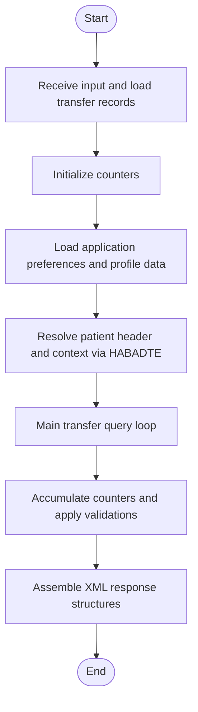
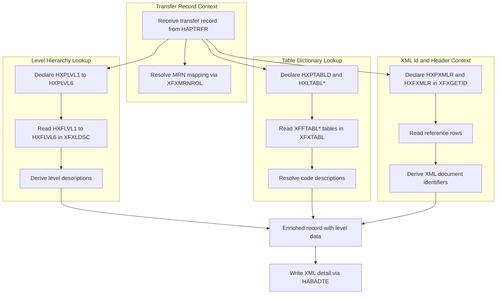
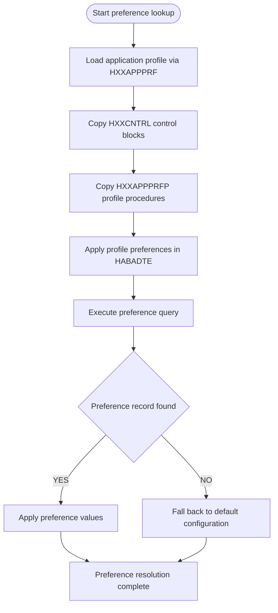
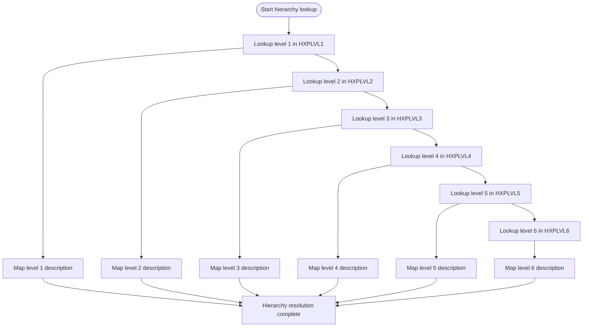

# Business Processing Flowchart – HABADTE Run 202607011209

## 1. Top-Level Processing Flow



## 2. Record Filter Gate

```mermaid
flowchart TD
    START([Start filtering]) --> BR002{BR-002: X equals 40}
    BR002 -->|EXCLUDE| EXIT1[Exit processing]
    BR002 -->|INCLUDE| BR003{BR-003: VYY < 1800}

    BR003 -->|EXCLUDE| EXIT2[Exit processing]
    BR003 -->|INCLUDE| BR004{BR-004: VYY > 2100}

    BR004 -->|EXCLUDE| EXIT3[Exit processing]
    BR004 -->|INCLUDE| BR005{BR-005: VMM < 01}

    BR005 -->|EXCLUDE| EXIT4[Exit processing]
    BR005 -->|INCLUDE| BR006{BR-006: VMM > 12}

    BR006 -->|EXCLUDE| EXIT5[Exit processing]
    BR006 -->|INCLUDE| BR007{BR-007: VDD < 01}

    BR007 -->|EXCLUDE| EXIT6[Exit processing]
    BR007 -->|INCLUDE| BR008{BR-008: VDD > DYS(VMM)}

    BR008 -->|EXCLUDE| EXIT7[Exit processing]
    BR008 -->|INCLUDE| BR018{BR-018: Flag indicator is void}

    BR018 -->|EXCLUDE| EXIT8[Skip voided record]
    BR018 -->|INCLUDE| BR019{BR-019: Inpatient outpatient flag is outpatient}

    BR019 -->|EXCLUDE| EXIT9[Skip outpatient record]
    BR019 -->|INCLUDE| BR017{BR-017: File indicator equals zero}

    BR017 -->|EXCLUDE| EXIT10[Skip missing file indicator]
    BR017 -->|INCLUDE| PASS[Record passes all filters]
```

## 3. Data Enrichment Flow



## 4. Counter and Aggregation Logic

```mermaid
flowchart TD
    CNT_START([Start counters]) --> CNT_TOTAL[Initialize totalRecordsRead]
    CNT_TOTAL --> CNT_SKIP_FILE[Initialize totalRecordsSkippedFile]
    CNT_SKIP_FILE --> CNT_SKIP_VOID[Initialize totalRecordsSkippedVoid]
    CNT_SKIP_VOID --> CNT_SKIP_OUTPT[Initialize totalRecordsSkippedOutpt]
    CNT_SKIP_OUTPT --> CNT_INCLUDED[Initialize totalRecordsIncluded]

    CNT_INCLUDED --> LOOP_REC[For each transfer record]

    LOOP_REC --> CHK_X_ZERO[BR-001: X equals zero]
    CHK_X_ZERO -->|TRUE| INC_SKIP_FILE[Increment totalRecordsSkippedFile]
    CHK_X_ZERO -->|FALSE| CHK_X_40[BR-002: X equals 40]

    CHK_X_40 -->|TRUE| INC_SKIP_FILE2[Increment totalRecordsSkippedFile]
    CHK_X_40 -->|FALSE| CHK_DATE_Y_LOW[BR-003: VYY < 1800]

    CHK_DATE_Y_LOW -->|TRUE| INC_SKIP_VOID[Increment totalRecordsSkippedVoid]
    CHK_DATE_Y_LOW -->|FALSE| CHK_DATE_Y_HIGH[BR-004: VYY > 2100]

    CHK_DATE_Y_HIGH -->|TRUE| INC_SKIP_VOID2[Increment totalRecordsSkippedVoid]
    CHK_DATE_Y_HIGH -->|FALSE| CHK_DATE_M_LOW[BR-005: VMM < 01]

    CHK_DATE_M_LOW -->|TRUE| INC_SKIP_OUTPT[Increment totalRecordsSkippedOutpt]
    CHK_DATE_M_LOW -->|FALSE| CHK_DATE_M_HIGH[BR-006: VMM > 12]

    CHK_DATE_M_HIGH -->|TRUE| INC_SKIP_OUTPT2[Increment totalRecordsSkippedOutpt]
    CHK_DATE_M_HIGH -->|FALSE| CHK_DATE_D_LOW[BR-007: VDD < 01]

    CHK_DATE_D_LOW -->|TRUE| INC_SKIP_OUTPT3[Increment totalRecordsSkippedOutpt]
    CHK_DATE_D_LOW -->|FALSE| CHK_DATE_D_HIGH[BR-008: VDD > DYS(VMM)]

    CHK_DATE_D_HIGH -->|TRUE| INC_SKIP_OUTPT4[Increment totalRecordsSkippedOutpt]
    CHK_DATE_D_HIGH -->|FALSE| CHK_FLAG_VOID[BR-018: Flag indicator is void]

    CHK_FLAG_VOID -->|TRUE| INC_SKIP_VOID3[Increment totalRecordsSkippedVoid]
    CHK_FLAG_VOID -->|FALSE| CHK_FLAG_OUTPT[BR-019: Inpatient outpatient flag is outpatient]

    CHK_FLAG_OUTPT -->|TRUE| INC_SKIP_OUTPT5[Increment totalRecordsSkippedOutpt]
    CHK_FLAG_OUTPT -->|FALSE| CHK_FILE_IND[BR-017: File indicator equals zero]

    CHK_FILE_IND -->|TRUE| INC_SKIP_FILE3[Increment totalRecordsSkippedFile]
    CHK_FILE_IND -->|FALSE| INC_INCLUDED[Increment totalRecordsIncluded]

    INC_INCLUDED --> LOOP_REC
```

## 5. Application Preference Lookup Flow



## 6. Org and Hierarchy Level Lookup Flow



## 7. End to End Summary Flow

```mermaid
flowchart LR
    subgraph "Input"
        INP_LOAD[Load transfer and master records]
    end

    subgraph "Setup Phase"
        SET_PREF[Load preferences and profiles]
        SET_INIT[Initialize counters and context]
    end

    subgraph "Data Query"
        QRY_HAPTRFR[Query HAPTRFR for eligible transfers]
        QRY_JOIN[Join with OMPMAST and benefit status tables]
    end

    subgraph "Per Record Enrichment Loop"
        ENR_DATE[Validate date via XFXCYMD]
        ENR_CNTR[Apply counter limits via XFXCNTR]
        ENR_LVL[Lookup hierarchy via XFXLDSC]
        ENR_TBL[Resolve table codes via XFXTABL]
        ENR_XMLID[Resolve XML identifiers via XFXGETID]
    end

    subgraph "Counting"
        CNT_UPDATE[Update per rule counters]
        CNT_SUMMARY[Compute final counter summary]
    end

    subgraph "Response"
        XML_HDR[Write XML header via HXFXMLH]
        XML_DET[Write XML detail via HXFXMLD]
        RESP_OUT[Return XML or API response]
    end

    INP_LOAD --> SET_PREF
    SET_PREF --> SET_INIT
    SET_INIT --> QRY_HAPTRFR
    QRY_HAPTRFR --> QRY_JOIN
    QRY_JOIN --> ENR_DATE
    ENR_DATE --> ENR_CNTR
    ENR_CNTR --> ENR_LVL
    ENR_LVL --> ENR_TBL
    ENR_TBL --> ENR_XMLID
    ENR_XMLID --> CNT_UPDATE
    CNT_UPDATE --> CNT_SUMMARY
    CNT_SUMMARY --> XML_HDR
    XML_HDR --> XML_DET
    XML_DET --> RESP_OUT
```


