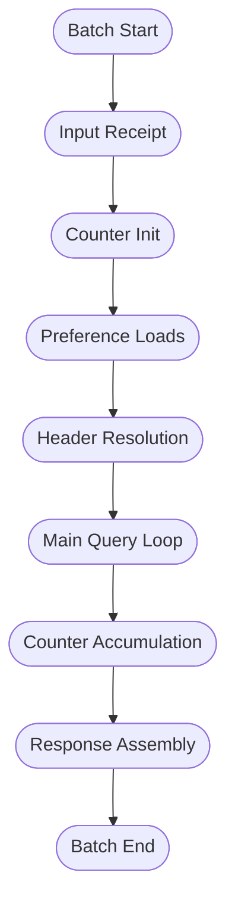
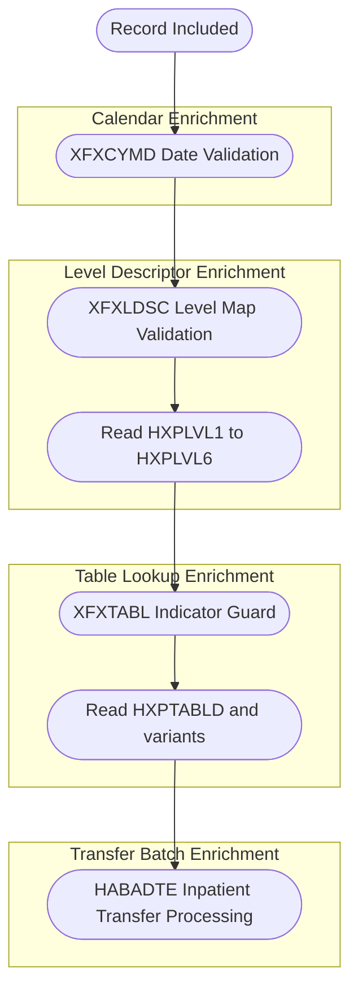
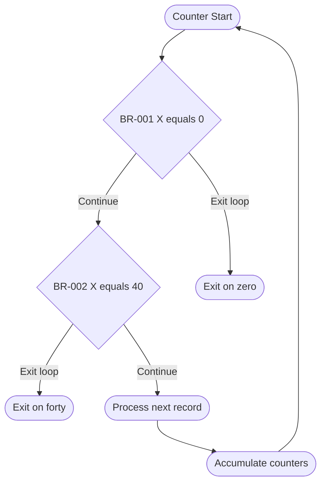
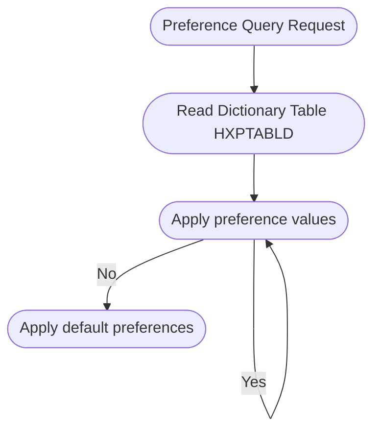
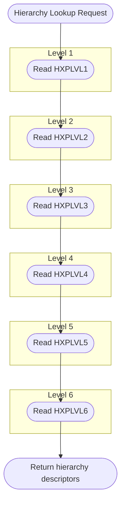

# Business Processing Flowcharts – HABADTE Project

This document provides visual flowcharts for the main business processing paths identified in the HABADTE project, using narratives and rules from the interpreted AS400 RPG programs.

## 1. Top-Level Processing Flow



## 2. Record Filter Gate

Record-level filters are driven by rules where `type = "filter"` in `business_rules.json`.

```mermaid
flowchart TD
    RECIN([Record In])

    subgraph "Filter Gate"
        BR002{BR-002 X equals 40}
        BR003{BR-003 VYY less than 1800}
        BR004{BR-004 VYY greater than 2100}
        BR005{BR-005 VMM less than 01}
        BR006{BR-006 VMM greater than 12}
        BR007{BR-007 VDD less than 01}
        BR008{BR-008 VDD greater than DYS(VMM)}
        BR009{BR-009 LDAMAP greater than 99}
        BR010{BR-010 LDAMAP greater than 99}
        BR011{BR-011 LDAMAP greater than 99}
        BR012{BR-012 LDAMAP greater than 9999}
        BR013{BR-013 IN79 on}
        BR014{BR-014 IN79 on}
        BR015{BR-015 IN79 on}
        BR016{BR-016 IN79 on}
        BR018{BR-018 Flag equals void}
        BR019{BR-019 Flag equals outpatient}
    end

    RECIN --> BR002
    BR002 -->|Exclude| EXC002([Exclude BR-002])
    BR002 -->|Include| BR003

    BR003 -->|Exclude| EXC003([Exclude BR-003])
    BR003 -->|Include| BR004

    BR004 -->|Exclude| EXC004([Exclude BR-004])
    BR004 -->|Include| BR005

    BR005 -->|Exclude| EXC005([Exclude BR-005])
    BR005 -->|Include| BR006

    BR006 -->|Exclude| EXC006([Exclude BR-006])
    BR006 -->|Include| BR007

    BR007 -->|Exclude| EXC007([Exclude BR-007])
    BR007 -->|Include| BR008

    BR008 -->|Exclude| EXC008([Exclude BR-008])
    BR008 -->|Include| BR009

    BR009 -->|Exclude| EXC009([Exclude BR-009])
    BR009 -->|Include| BR010

    BR010 -->|Exclude| EXC010([Exclude BR-010])
    BR010 -->|Include| BR011

    BR011 -->|Exclude| EXC011([Exclude BR-011])
    BR011 -->|Include| BR012

    BR012 -->|Exclude| EXC012([Exclude BR-012])
    BR012 -->|Include| BR013

    BR013 -->|Exclude| EXC013([Exclude BR-013])
    BR013 -->|Include| BR014

    BR014 -->|Exclude| EXC014([Exclude BR-014])
    BR014 -->|Include| BR015

    BR015 -->|Exclude| EXC015([Exclude BR-015])
    BR015 -->|Include| BR016

    BR016 -->|Exclude| EXC016([Exclude BR-016])
    BR016 -->|Include| BR018

    BR018 -->|Exclude| EXC018([Exclude BR-018])
    BR018 -->|Include| BR019

    BR019 -->|Exclude| EXC019([Exclude BR-019])
    BR019 -->|Include| RECOK([Record Included])
```

## 3. Data Enrichment Flow

Data enrichment uses key rules per program domain to perform secondary lookups.



## 4. Counter and Aggregation Logic

Counters and validations control loop termination and aggregation.



## 5. Application Preference Lookup Flow

Application preferences and configuration are inferred from XFXTABL and related narratives.



## 6. Org and Hierarchy Level Lookup Flow

Organizational hierarchy uses multiple level files HXPLVL1 to HXPLVL6.



## 7. End-to-End Summary Flow

```mermaid
flowchart LR

    subgraph "Input"
        INREC([Input Receipt])
    end

    subgraph "Setup Phase"
        SETCNT([Initialize counters])
        SETPREF([Load preferences and dictionaries])
    end

    subgraph "Data Query"
        QRYTRN([Query transfer records from HAPTRFR])
    end

    subgraph "Per-Record Enrichment Loop"
        ENRICHREC([Enrich record with dates, levels, tables])
    end

    subgraph "Counting"
        COUNTSUM([Update counters and summaries])
    end

    subgraph "Response"
        XMLHDR([Write XML header HXFXMLH])
        XMLDET([Write XML detail HXFXMLD])
    end

    INREC --> SETCNT
    SETCNT --> SETPREF
    SETPREF --> QRYTRN
    QRYTRN --> ENRICHREC
    ENRICHREC --> COUNTSUM
    COUNTSUM --> XMLHDR
    XMLHDR --> XMLDET
```


