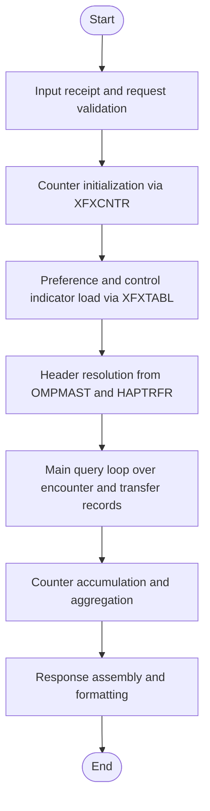
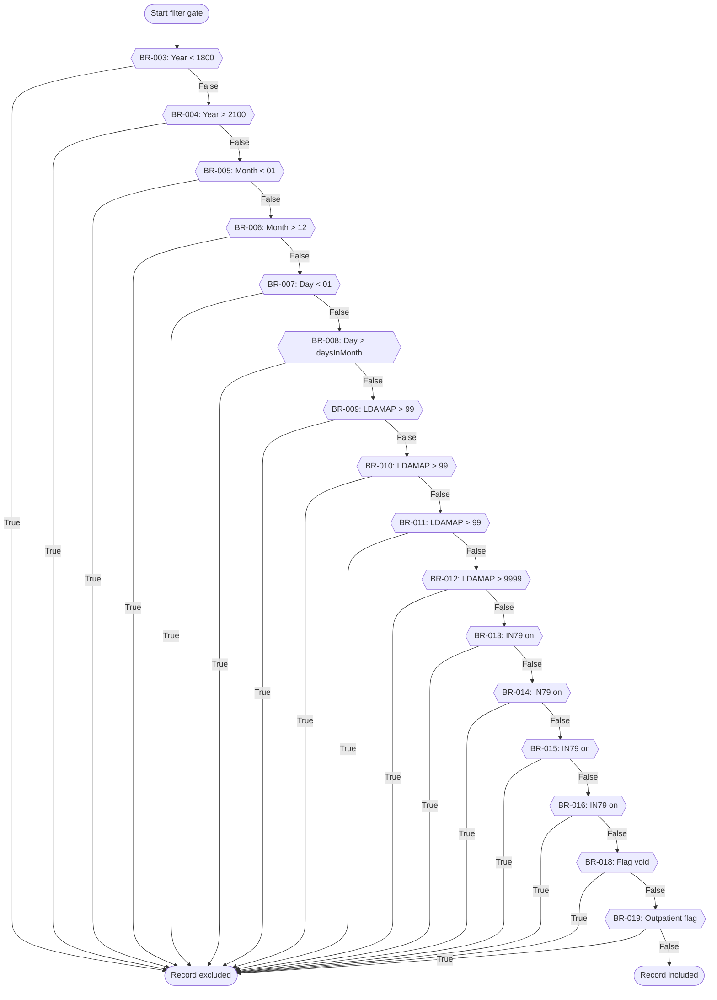
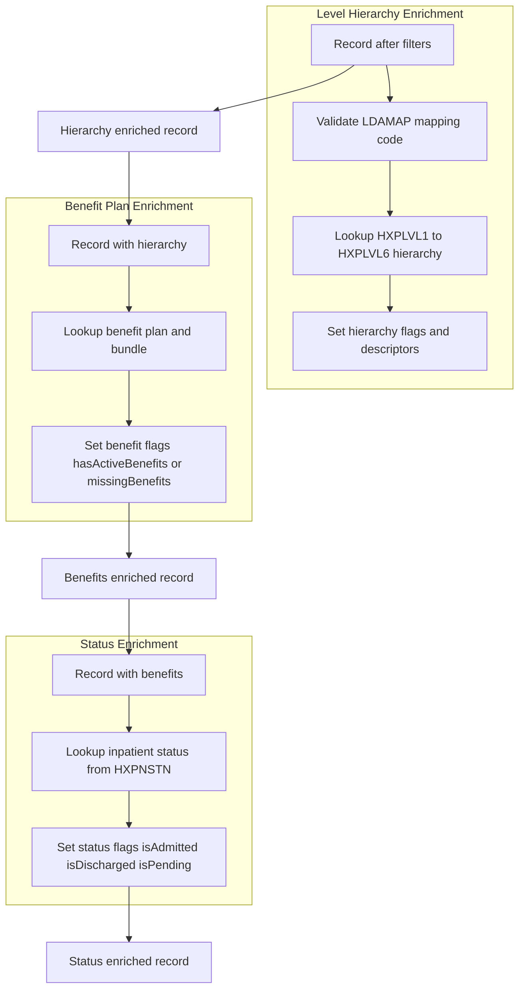
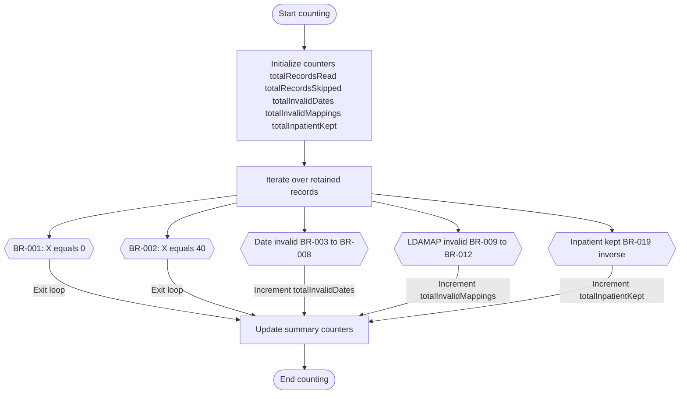
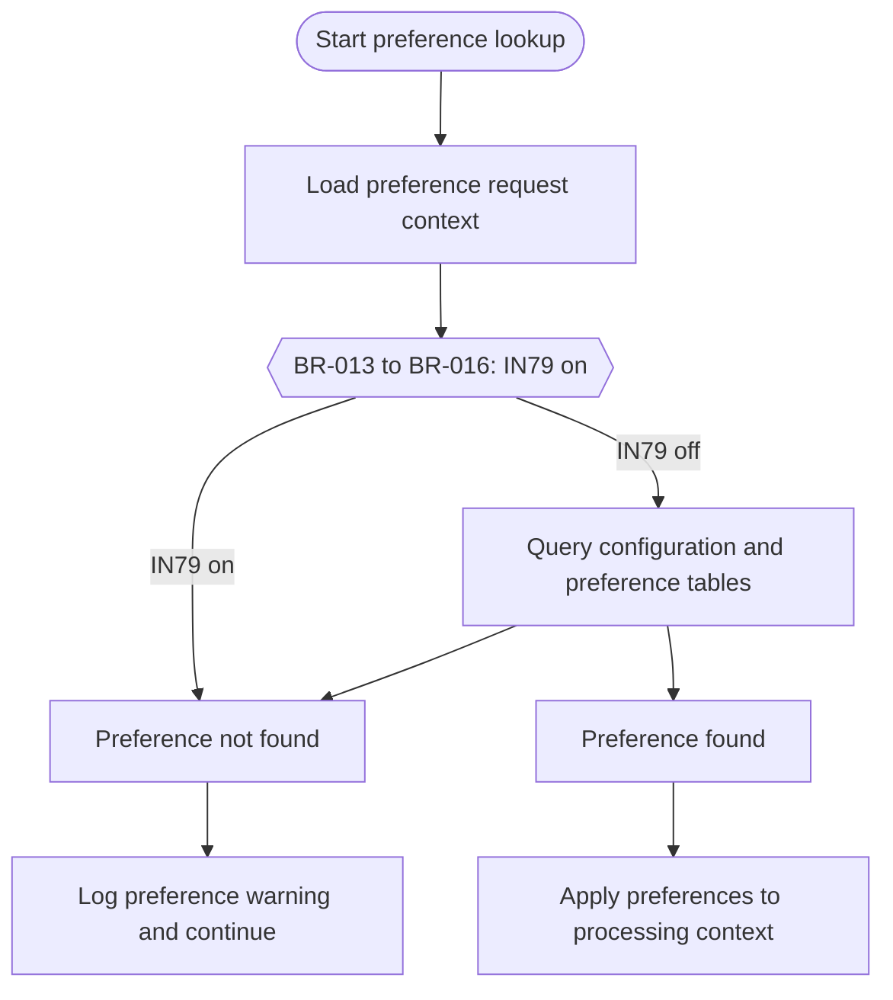
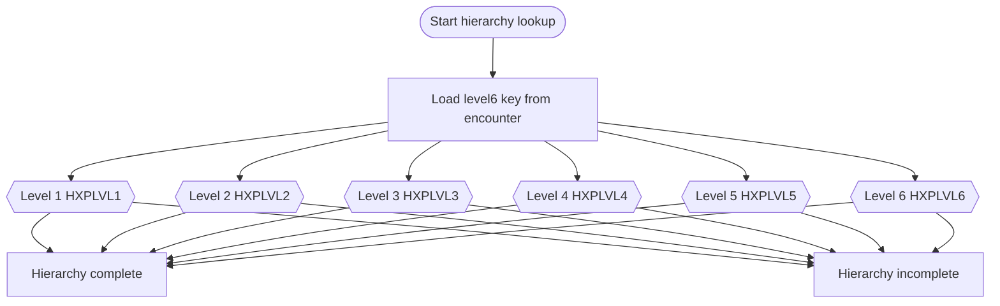

# Business Processing Flowcharts – HABADTE Patient Management Engine

This document summarizes the end to end HABADTE processing flow using Mermaid flowcharts. The flows are derived from semantic interpretations and the approved business rules catalog.

---

## 1. Top Level Processing Flow

---

## 2. Record Filter Gate (Filter Rules)

---

## 3. Data Enrichment Flow

---

## 4. Counter and Aggregation Logic

---

## 5. Application Preference Lookup Flow

---

## 6. Org Hierarchy Level Lookup Flow

---

## 7. End to End Summary Flow

```mermaid
flowchart LR
    subgraph Input
        IN_START([Start])
        IN_REQ[Receive request and validate]
        IN_START --> IN_REQ
    end

    subgraph "Setup Phase"
        SET_COUNTER[Initialize counters via XFXCNTR]
        SET_PREF[Load preferences and control indicators via XFXTABL]
        SET_COUNTER --> SET_PREF
    end

    subgraph "Data Query"
        QRY_HEADER[Read patient header from OMPMAST]
        QRY_TRANS[Read transfer records from HAPTRFR]
        QRY_FILTERS[Apply filter rules BR-003 to BR-019]
        QRY_HEADER --> QRY_TRANS --> QRY_FILTERS
    end

    subgraph "Per Record Enrichment Loop"
        ENR_HIER[Enrich hierarchy using HXPLVL1 to HXPLVL6]
        ENR_BEN[Enrich benefits using OXPBNFIT or HXPBNFIT]
        ENR_STATUS[Enrich status using HXPNSTN]
        ENR_HIER --> ENR_BEN --> ENR_STATUS
    end

    subgraph Counting
        CNT_INIT[Initialize aggregation counters]
        CNT_UPDATE[Update counts totalRecordsRead totalRecordsSkipped totalInvalidDates totalInvalidMappings totalInpatientKept]
        CNT_INIT --> CNT_UPDATE
    end

    subgraph Response
        RESP_BUILD[Assemble header detail and summary]
        RESP_WRITE[Write output to HXFXMLD and HXFXMLH]
        RESP_RETURN[Return response to caller]
        RESP_BUILD --> RESP_WRITE --> RESP_RETURN
    end

    IN_REQ --> SET_COUNTER
    SET_PREF --> QRY_HEADER
    QRY_FILTERS --> ENR_HIER
    ENR_STATUS --> CNT_INIT
    CNT_UPDATE --> RESP_BUILD
```

