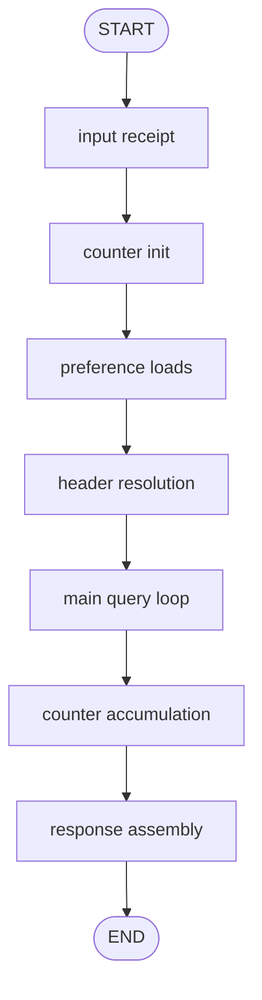
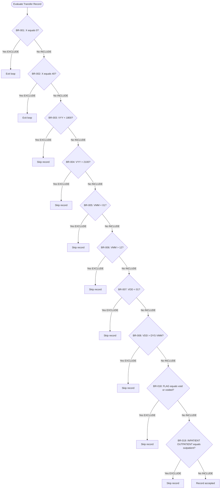
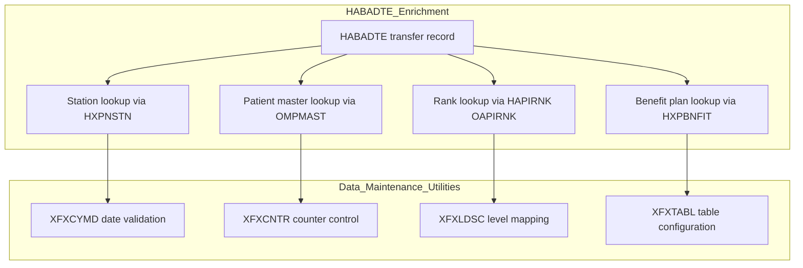
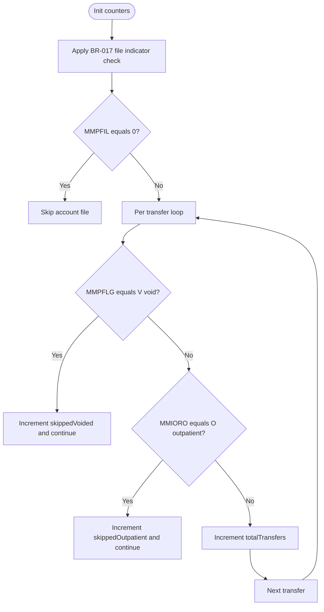
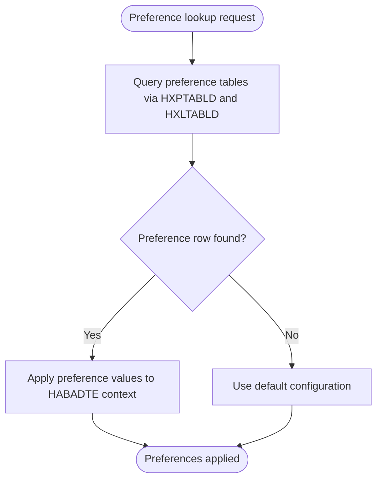
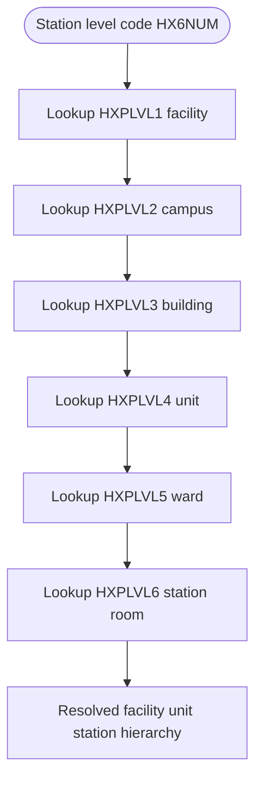

# Business Processing Flowchart – HABADTE Project

Run ID: 202607011209

This document provides visual flowcharts for the HABADTE inpatient transfer XML export process and related Data Maintenance utilities.

## 1. Top-Level Processing Flow

## 2. Record Filter Gate

## 3. Data Enrichment Flow

## 4. Counter and Aggregation Logic

## 5. Application Preference Lookup Flow

## 6. Org and Hierarchy Level Lookup Flow

## 7. End to End Summary Flow

```mermaid
flowchart LR
    subgraph Input
        INREQ[Inpatient transfer request]
    end

    subgraph "Setup Phase"
        SET1[Validate dates via XFXCYMD]
        SET2[Load preferences and tables via XFXTABL]
    end

    subgraph "Data Query"
        Q1[Read transfers from HAPTRFR]
    end

    subgraph "Per Record Enrichment Loop"
        E1[Apply BR-018 void filter]
        E2[Apply BR-019 outpatient filter]
        E3[Station enrichment via HXPNSTN]
        E4[Benefit enrichment via HXPBNFIT]
        E5[Rank and master enrichment via HAPIRNK and OMPMAST]
    end

    subgraph Counting
        C1[Update totalTransfers]
        C2[Update skippedVoided]
        C3[Update skippedOutpatient]
        C4[Update skippedByFileFlag]
    end

    subgraph Response
        R1[Build XML HXFXMLH and HXFXMLD]
        R2[Return inpatient transfer summary]
    end

    INREQ --> SET1
    SET1 --> SET2
    SET2 --> Q1
    Q1 --> E1
    E1 --> E2
    E2 --> E3
    E3 --> E4
    E4 --> E5
    E5 --> C1
    C1 --> C2
    C2 --> C3
    C3 --> C4
    C4 --> R1
    R1 --> R2
```

