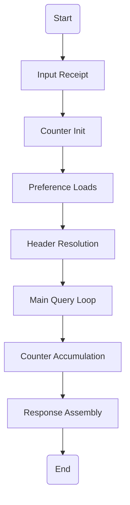
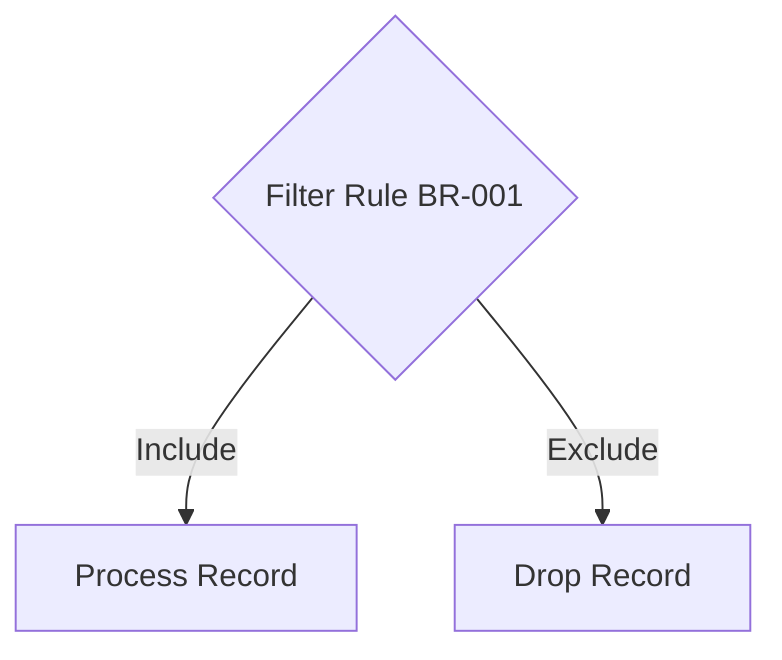
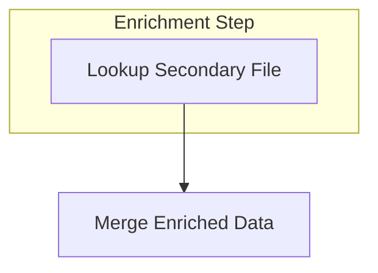
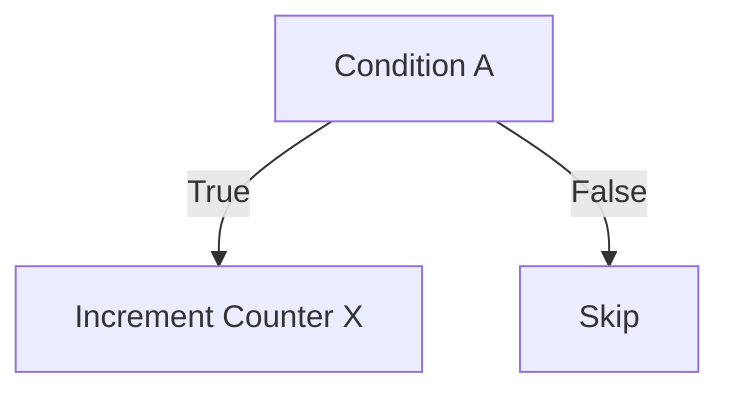
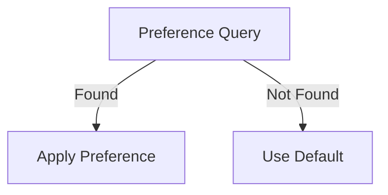
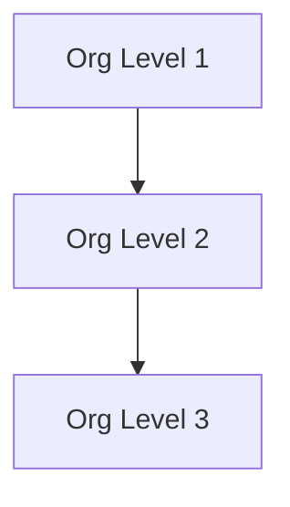
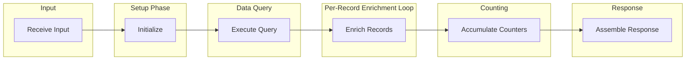

# Business Processing Flowchart

*(placeholder content – to be replaced by actual flowchart content generated from interpretations.json, business_rules.json, and aggregated_context.json)*

```mermaid
flowchart TD
  A(Start) --> B[Input Receipt]
  B --> C[Counter Init]
  C --> D[Preference Loads]
  D --> E[Header Resolution]
  E --> F[Main Query Loop]
  F --> G[Counter Accumulation]
  G --> H[Response Assembly]
  H --> I(End)
```

```mermaid
flowchart TD
  F1{Filter Rule BR-001} -->|Include| P1[Process Record]
  F1 -->|Exclude| X1[Drop Record]
```

```mermaid
flowchart TD
  subgraph "Enrichment Step"
    E1[Lookup Secondary File]
  end

  E1 --> E2[Merge Enriched Data]
```

```mermaid
flowchart TD
  C1[Condition A] -->|True| C2[Increment Counter X]
  C1 -->|False| C3[Skip]
```

```mermaid
flowchart TD
  P1[Preference Query] -->|Found| P2[Apply Preference]
  P1 -->|Not Found| P3[Use Default]
```

```mermaid
flowchart TD
  O1[Org Level 1] --> O2[Org Level 2]
  O2 --> O3[Org Level 3]
```

```mermaid
flowchart LR
  subgraph Input
    I1[Receive Input]
  end

  subgraph "Setup Phase"
    S1[Initialize]
  end

  subgraph "Data Query"
    Q1[Execute Query]
  end

  subgraph "Per-Record Enrichment Loop"
    L1[Enrich Records]
  end

  subgraph Counting
    C1[Accumulate Counters]
  end

  subgraph Response
    R1[Assemble Response]
  end

  I1 --> S1
  S1 --> Q1
  Q1 --> L1
  L1 --> C1
  C1 --> R1
```
