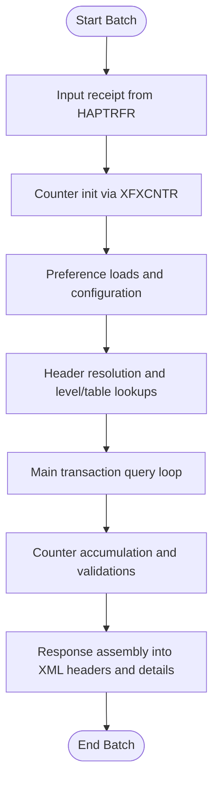
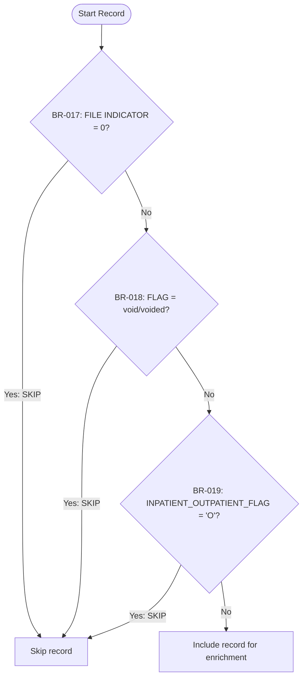
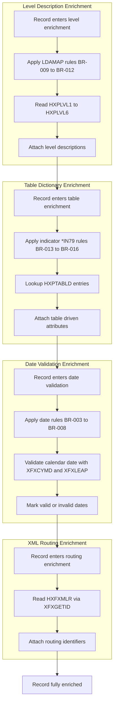
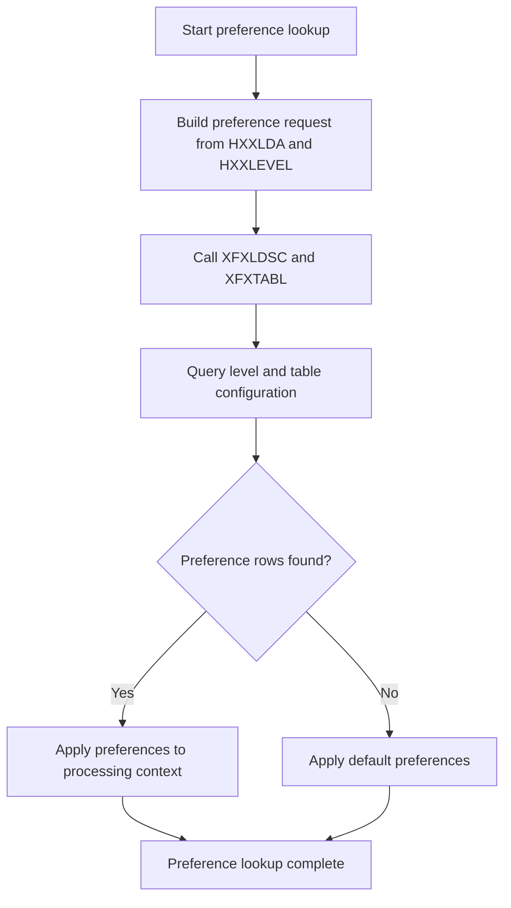
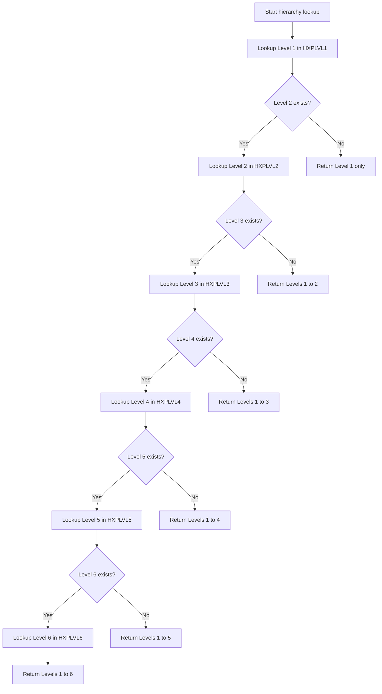

# Business Processing Flowchart – HABADTE Run 202607020629

This document describes the HABADTE patient management batch flow using Mermaid flowcharts. All diagrams are generated from AS400 RPG metadata and semantic interpretations.

## 1. Top-Level Processing Flow



## 2. Record Filter Gate



## 3. Data Enrichment Flow



## 4. Counter / Aggregation Logic

```mermaid
flowchart TD
    C_START[Begin counter processing] --> C_BR001{BR-001: X = 0?}
    C_BR001 -- "Yes" --> C_EXIT[Exit counter routine]
    C_BR001 -- "No" --> C_BR002{BR-002: X = 40?}
    C_BR002 -- "Yes" --> C_EXIT
    C_BR002 -- "No" --> C_CONT[Continue counting and aggregation]

    C_CONT --> VAL_START[Begin validation counters]
    VAL_START --> V_BR003{BR-003: Year < 1800?}
    V_BR003 -- "Yes" --> V_EXIT[Flag invalid date]
    V_BR003 -- "No" --> V_BR004{BR-004: Year > 2100?}
    V_BR004 -- "Yes" --> V_EXIT
    V_BR004 -- "No" --> V_BR005{BR-005: Month < 1?}
    V_BR005 -- "Yes" --> V_EXIT
    V_BR005 -- "No" --> V_BR006{BR-006: Month > 12?}
    V_BR006 -- "Yes" --> V_EXIT
    V_BR006 -- "No" --> V_BR007{BR-007: Day < 1?}
    V_BR007 -- "Yes" --> V_EXIT
    V_BR007 -- "No" --> V_BR008{BR-008: Day > DYS(Month)?}
    V_BR008 -- "Yes" --> V_EXIT
    V_BR008 -- "No" --> V_OK[Increment valid date counters]
```

## 5. Application Preference Lookup Flow



## 6. Org / Hierarchy Level Lookup Flow



## 7. End-to-End Summary Flow

```mermaid
flowchart LR
    subgraph "Input"
        IN1[Receive transactions from HAPTRFR]
    end

    subgraph "Setup Phase"
        S1[Load counters and context]
        S2[Load preferences and copybooks]
    end

    subgraph "Data Query"
        Q1[Iterate over HAPTRFR records]
        Q2[Apply filter gate BR-017 to BR-019]
    end

    subgraph "Per-Record Enrichment Loop"
        E1[Level description via XFXLDSC]
        E2[Table dictionary via XFXTABL]
        E3[Date validation via XFXCYMD]
        E4[XML routing via XFXGETID]
    end

    subgraph "Counting"
        C1[Counter exits via XFXCNTR]
        C2[Maintain totals and invalid date counts]
    end

    subgraph "Response"
        R1[Build XML header HXFXMLH]
        R2[Write XML detail HXFXMLD]
        R3[Update statement status XFFNSTN]
    end

    IN1 --> S1
    S1 --> S2
    S2 --> Q1
    Q1 --> Q2
    Q2 --> E1
    E1 --> E2
    E2 --> E3
    E3 --> E4
    E4 --> C1
    C1 --> C2
    C2 --> R1
    R1 --> R2
    R2 --> R3
```


