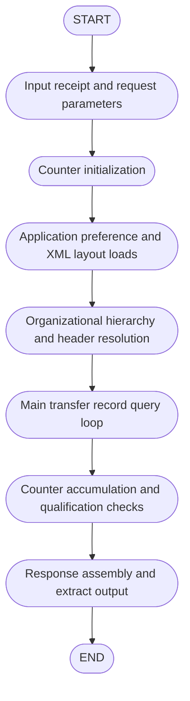
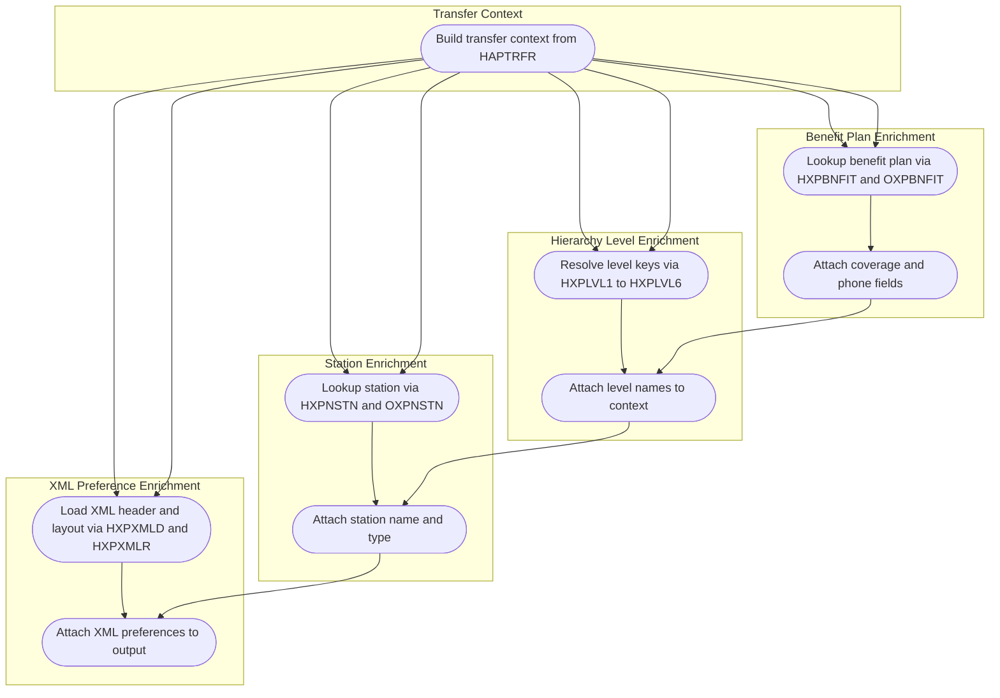
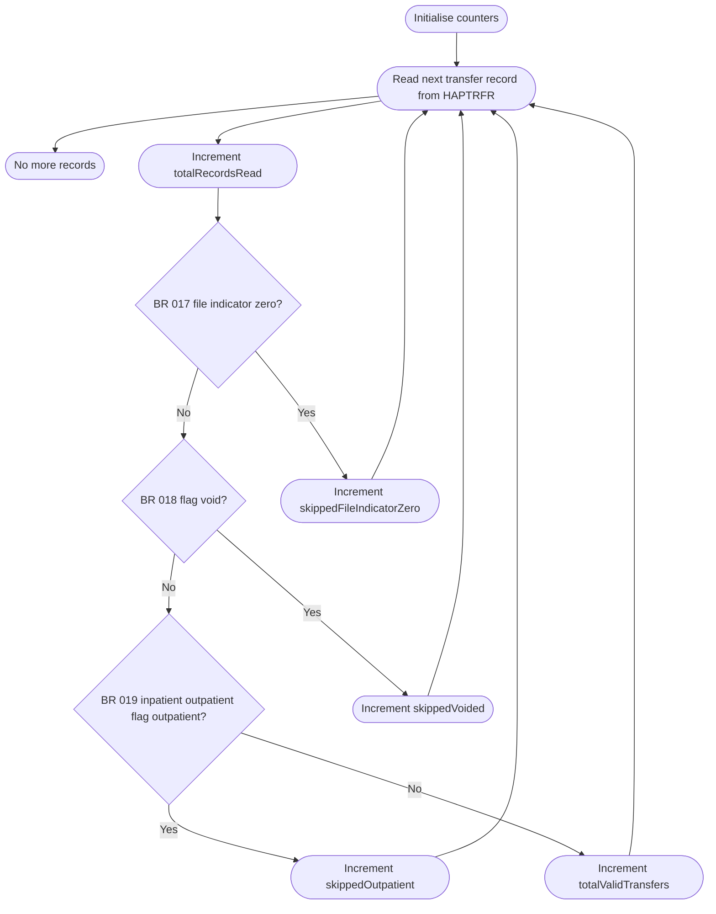
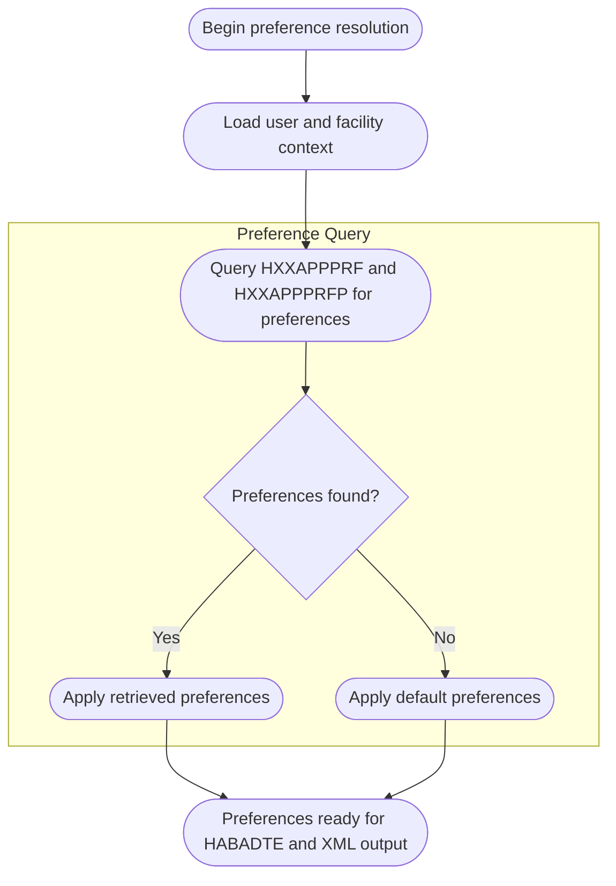
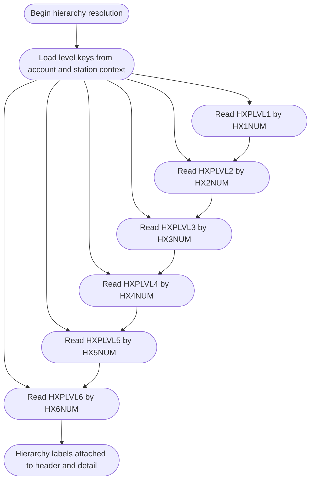

# Business Processing Flowchart

This document describes the end to end processing flow for the HABADTE inpatient transfer activity extract and its supporting DATA_MAINTENANCE utilities. The flowcharts are derived from reverse engineered business rules and program interpretations for programs XFXCNTR, XFXCYMD, XFXLDSC, XFXTABL, and HABADTE.

## 1. Top Level Processing Flow



## 2. Record Filter Gate

```mermaid
flowchart TD
  %% Record Filter Gate based on filter type rules
  Start([Record enters HABADTE per HAPTRFR read])

  BR003{BR 003 VYY < 1800?}
  BR004{BR 004 VYY > 2100?}
  BR005{BR 005 VMM < 01?}
  BR006{BR 006 VMM > 12?}
  BR007{BR 007 VDD < 01?}
  BR008{BR 008 VDD > DYS(VMM)?}
  BR009{BR 009 LDAMAP > 99?}
  BR010{BR 010 LDAMAP > 99?}
  BR011{BR 011 LDAMAP > 99?}
  BR012{BR 012 LDAMAP > 9999?}
  BR013{BR 013 IN79 on?}
  BR014{BR 014 IN79 on?}
  BR015{BR 015 IN79 on?}
  BR016{BR 016 IN79 on?}
  BR018{BR 018 flag void?}
  BR019{BR 019 inpatient outpatient flag outpatient?}

  Excluded([EXCLUDE record from processing])
  Included([INCLUDE record and proceed])

  Start --> BR003
  BR003 -- Yes EXCLUDE --> Excluded
  BR003 -- No --> BR004
  BR004 -- Yes EXCLUDE --> Excluded
  BR004 -- No --> BR005
  BR005 -- Yes EXCLUDE --> Excluded
  BR005 -- No --> BR006
  BR006 -- Yes EXCLUDE --> Excluded
  BR006 -- No --> BR007
  BR007 -- Yes EXCLUDE --> Excluded
  BR007 -- No --> BR008
  BR008 -- Yes EXCLUDE --> Excluded
  BR008 -- No --> BR009

  BR009 -- Yes EXCLUDE --> Excluded
  BR009 -- No --> BR010
  BR010 -- Yes EXCLUDE --> Excluded
  BR010 -- No --> BR011
  BR011 -- Yes EXCLUDE --> Excluded
  BR011 -- No --> BR012
  BR012 -- Yes EXCLUDE --> Excluded
  BR012 -- No --> BR013

  BR013 -- Yes EXCLUDE --> Excluded
  BR013 -- No --> BR014
  BR014 -- Yes EXCLUDE --> Excluded
  BR014 -- No --> BR015
  BR015 -- Yes EXCLUDE --> Excluded
  BR015 -- No --> BR016
  BR016 -- Yes EXCLUDE --> Excluded
  BR016 -- No --> BR018

  BR018 -- Yes EXCLUDE --> Excluded
  BR018 -- No --> BR019
  BR019 -- Yes EXCLUDE --> Excluded
  BR019 -- No INCLUDE --> Included
```

## 3. Data Enrichment Flow



## 4. Counter and Aggregation Logic



## 5. Application Preference Lookup Flow



## 6. Org Hierarchy Level Lookup Flow



## 7. End to End Summary Flow

```mermaid
flowchart LR
  %% End to end summary processing flow

  subgraph "Input"
    InStart([Receive request parameters and user context])
  end

  subgraph "Setup Phase"
    SetupCounters([Initialise counters and context])
    SetupPrefs([Resolve application preferences and XML layout])
  end

  subgraph "Data Query"
    QueryTransfers([Query HAPTRFR for transfer records])
  end

  subgraph "Per Record Enrichment Loop"
    LoopStart([For each qualifying transfer])
    EnrichBenefit([Enrich with benefit plan])
    EnrichHierarchy([Enrich with org hierarchy])
    EnrichStation([Enrich with station details])
    EnrichXml([Attach XML header elements])
  end

  subgraph "Counting"
    ApplyRules([Apply BR 017 BR 018 BR 019])
    UpdateCounters([Update counters for valid and skipped])
  end

  subgraph "Response"
    BuildExtract([Build header detail footer payload])
    SendOutput([Return data set or write XML print])
  end

  InStart --> SetupCounters
  SetupCounters --> SetupPrefs
  SetupPrefs --> QueryTransfers

  QueryTransfers --> LoopStart
  LoopStart --> EnrichBenefit
  EnrichBenefit --> EnrichHierarchy
  EnrichHierarchy --> EnrichStation
  EnrichStation --> EnrichXml

  LoopStart --> ApplyRules
  ApplyRules --> UpdateCounters

  EnrichXml --> BuildExtract
  UpdateCounters --> BuildExtract
  BuildExtract --> SendOutput
```


