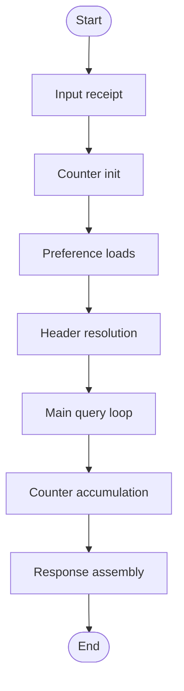
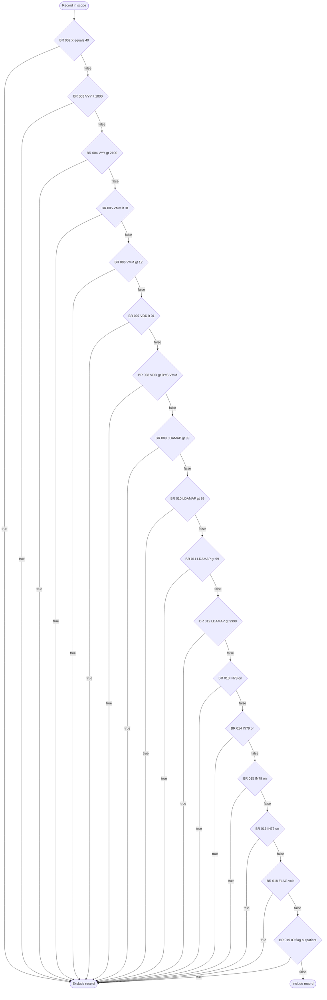
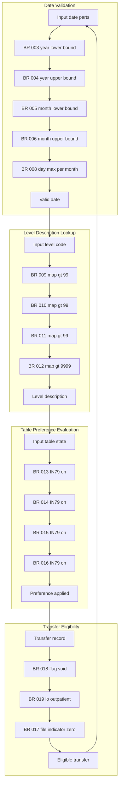
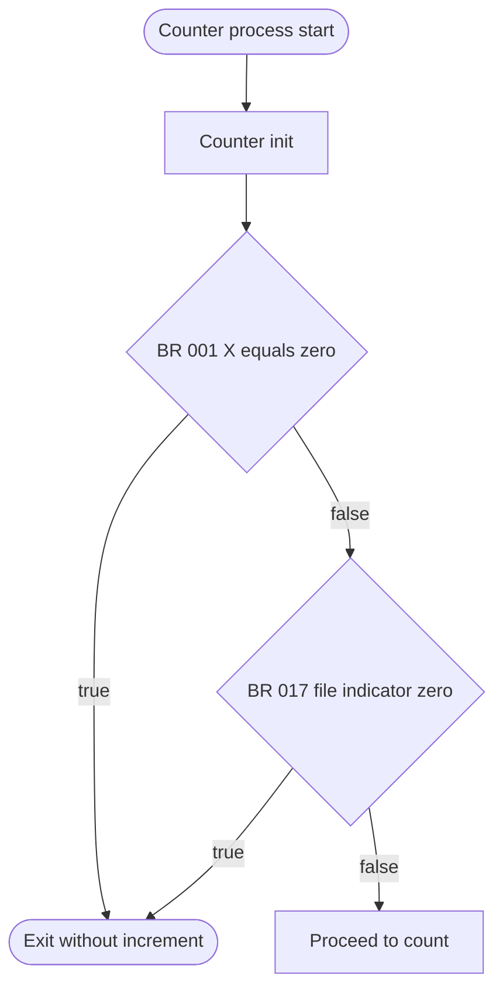
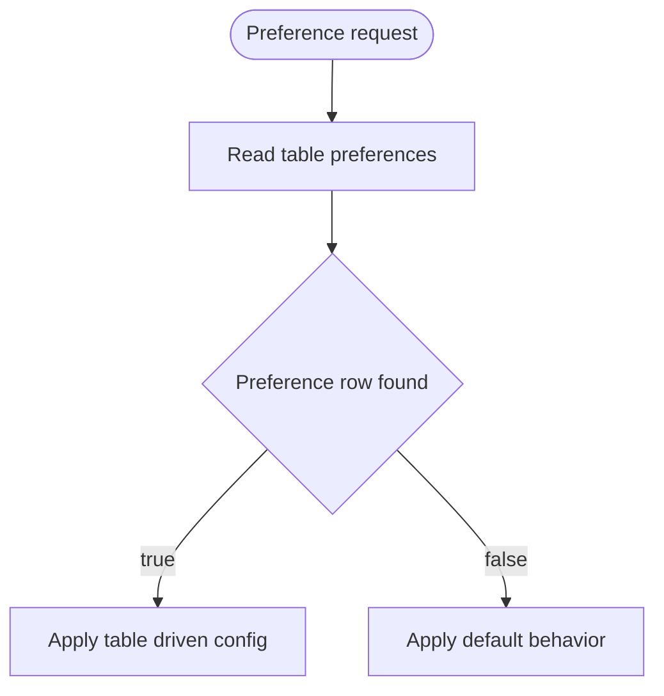
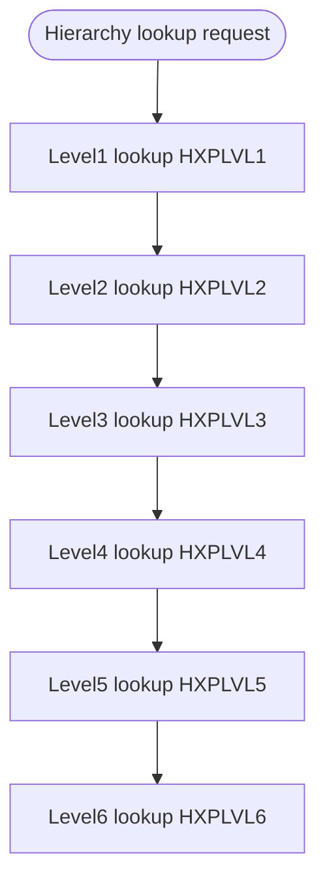

# Business Processing Flowchart

This document describes the end to end business processing for the HABADTE inpatient transfer extract and its supporting DATA_MAINTENANCE utilities, using Mermaid flowcharts embedded inline.

## 1. Top Level Processing Flow

## 2. Record Filter Gate

## 3. Data Enrichment Flow

## 4. Counter and Aggregation Logic

## 5. Application Preference Lookup Flow

## 6. Org Hierarchy Level Lookup Flow

## 7. End to End Summary Flow

```mermaid
flowchart LR
    %% End to end summary from input to response

    subgraph "Input"
        I_IN[Request params level6 and account]
    end

    subgraph "Setup Phase"
        S_CNT[XFXCNTR counter checks]
        S_PREF[XFXTABL preferences]
    end

    subgraph "Data Query"
        Q_TRFR[Query HAPTRFR transfers]
    end

    subgraph "Per Record Enrichment Loop"
        E_DATE[XFXCYMD date validation]
        E_LEVEL[XFXLDSC level description]
        E_STATUS[Status lookup HXPNSTN]
        E_BENEFIT[Benefit lookup HXPBNFIT]
    end

    subgraph "Counting"
        C_SKIP[Count skipped by BR 017 to BR 019]
        C_INC[Count included]
    end

    subgraph "Response"
        R_OUT[Assemble transfer extract]
    end

    I_IN --> S_CNT
    S_CNT --> S_PREF
    S_PREF --> Q_TRFR
    Q_TRFR --> E_DATE
    E_DATE --> E_LEVEL
    E_LEVEL --> E_STATUS
    E_STATUS --> E_BENEFIT
    E_BENEFIT --> C_SKIP
    E_BENEFIT --> C_INC
    C_SKIP --> R_OUT
    C_INC --> R_OUT
```

