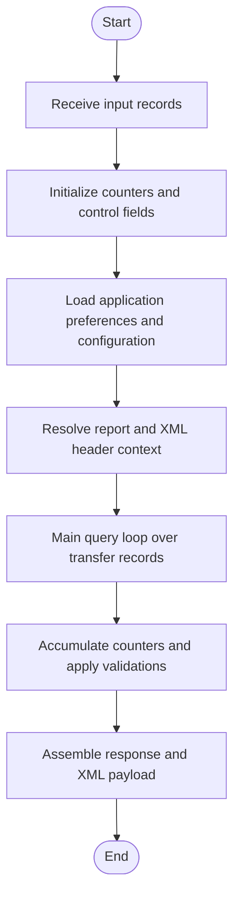
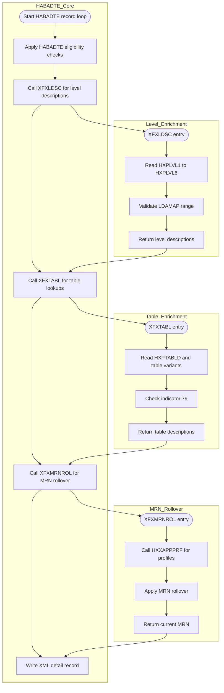
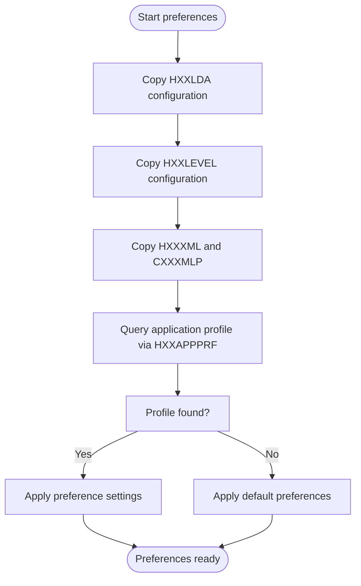
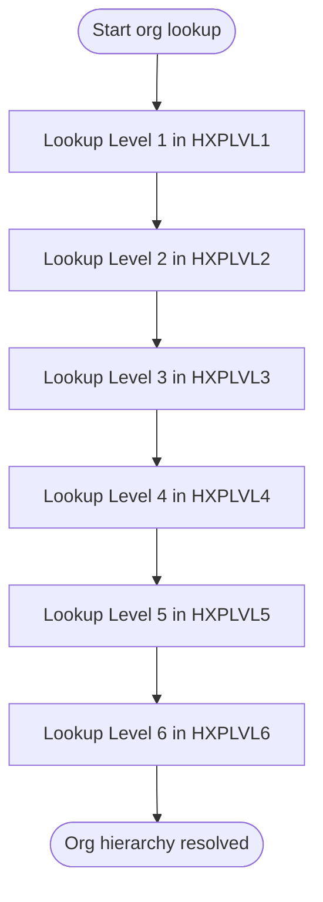

# Business Processing Flowchart – HABADTE Application

This document describes the HABADTE end to end processing logic using Mermaid flowcharts. Each section embeds a flowchart capturing program level behavior inferred from narratives and business rules.

## 1. Top Level Processing Flow



## 2. Record Filter Gate

```mermaid
flowchart TD
    START_FILTER([Start Filtering]) --> BR001[X equals zero? (BR-001)]
    BR001 -->|Yes - EXIT| EXIT1([Exit - no work])
    BR001 -->|No| BR002[X equals 40? (BR-002)]
    BR002 -->|Yes - EXIT| EXIT2([Exit - batch limit reached])
    BR002 -->|No| BR003[VYY less than 1800? (BR-003)]
    BR003 -->|Yes - EXCLUDE| EXCL_YEAR_LOW([Exclude record - invalid year])
    BR003 -->|No| BR004[VYY greater than 2100? (BR-004)]
    BR004 -->|Yes - EXCLUDE| EXCL_YEAR_HIGH([Exclude record - invalid year])
    BR004 -->|No| BR005[VMM less than 01? (BR-005)]
    BR005 -->|Yes - EXCLUDE| EXCL_MONTH_LOW([Exclude record - invalid month])
    BR005 -->|No| BR006[VMM greater than 12? (BR-006)]
    BR006 -->|Yes - EXCLUDE| EXCL_MONTH_HIGH([Exclude record - invalid month])
    BR006 -->|No| BR007[VDD less than 01? (BR-007)]
    BR007 -->|Yes - EXCLUDE| EXCL_DAY_LOW([Exclude record - invalid day])
    BR007 -->|No| BR008[VDD greater than DYS(VMM)? (BR-008)]
    BR008 -->|Yes - EXCLUDE| EXCL_DAY_HIGH([Exclude record - invalid day])
    BR008 -->|No| BR009[LDAMAP greater than 99? (BR-009/010/011)]
    BR009 -->|Yes - EXCLUDE| EXCL_MAP_RANGE([Exclude record - invalid mapping])
    BR009 -->|No| BR012[LDAMAP greater than 9999? (BR-012)]
    BR012 -->|Yes - EXCLUDE| EXCL_MAP_ABS([Exclude record - mapping overflow])
    BR012 -->|No| BR013[*IN79 on or active? (BR-013/014/015/016)]
    BR013 -->|Yes - EXIT| EXIT_TBL([Exit table lookup])
    BR013 -->|No| BR017[File indicator equals zero? (BR-017)]
    BR017 -->|Yes - EXCLUDE| EXCL_FILE_IND([Skip record - invalid file])
    BR017 -->|No| BR018[Flag indicator equals void? (BR-018)]
    BR018 -->|Yes - EXCLUDE| EXCL_VOID([Skip record - void transfer])
    BR018 -->|No| BR019[Inpatient flag equals outpatient? (BR-019)]
    BR019 -->|Yes - EXCLUDE| EXCL_OUTPATIENT([Skip record - outpatient])
    BR019 -->|No - INCLUDE| INCLUDE_REC([Include record in processing])
```

## 3. Data Enrichment Flow



## 4. Counter and Aggregation Logic

```mermaid
flowchart TD
    CNT_START([Start counters]) --> CNT_INIT[Initialize counters]
    CNT_INIT --> CNT_LOOP[Loop over eligible records]

    CNT_LOOP --> CNT_X_ZERO[X equals zero? (BR-001)]
    CNT_X_ZERO -->|Yes| CNT_EXIT_ZERO[Exit loop - no items]
    CNT_X_ZERO -->|No| CNT_X_FORTY[X equals 40? (BR-002)]
    CNT_X_FORTY -->|Yes| CNT_EXIT_LIMIT[Exit loop - batch limit]
    CNT_X_FORTY -->|No| CNT_INC[Increment processedTransfers]

    CNT_INC --> CNT_DATE_VAL[Validate date via XFXCYMD]
    CNT_DATE_VAL --> DATE_INVALID[Date invalid?]
    DATE_INVALID -->|Yes| CNT_DATE_FAIL[Increment dateValidationFailures]
    CNT_DATE_FAIL --> CNT_NEXT[Move to next record]
    DATE_INVALID -->|No| CNT_NEXT_VALID[Continue processing]
    CNT_NEXT_VALID --> CNT_NEXT

    CNT_NEXT --> CNT_LOOP
```

## 5. Application Preference Lookup Flow



## 6. Org and Hierarchy Level Lookup Flow



## 7. End to End Summary Flow

```mermaid
flowchart LR
    subgraph Input
        IN_START([Start])
        IN_START --> IN_READ[Read transfer and context inputs]
    end

    subgraph "Setup Phase"
        SET_PREF[Load preferences and profiles]
        SET_HDR[Resolve header and sequence]
    end

    subgraph "Data Query"
        QRY_HAPTRFR[Query HAPTRFR transfer records]
        QRY_MASTER[Access OMPMAST and related data]
    end

    subgraph "Per-Record Enrichment Loop"
        ENR_FILTER[Apply HABADTE eligibility filters]
        ENR_DATE[Validate dates via XFXCYMD]
        ENR_LEVEL[Enrich levels via XFXLDSC]
        ENR_DICT[Enrich dictionary via XFXTABL]
        ENR_MRN[Apply MRN rollover]
    end

    subgraph Counting
        CNT_TRACK[Track counters and totals]
    end

    subgraph Response
        RESP_XML[Write XML header and detail]
        RESP_OUT[Return response payload]
    end

    IN_READ --> SET_PREF
    SET_PREF --> SET_HDR
    SET_HDR --> QRY_HAPTRFR
    QRY_HAPTRFR --> ENR_FILTER
    ENR_FILTER --> ENR_DATE
    ENR_DATE --> ENR_LEVEL
    ENR_LEVEL --> ENR_DICT
    ENR_DICT --> ENR_MRN
    ENR_MRN --> CNT_TRACK
    CNT_TRACK --> RESP_XML
    RESP_XML --> RESP_OUT
```


