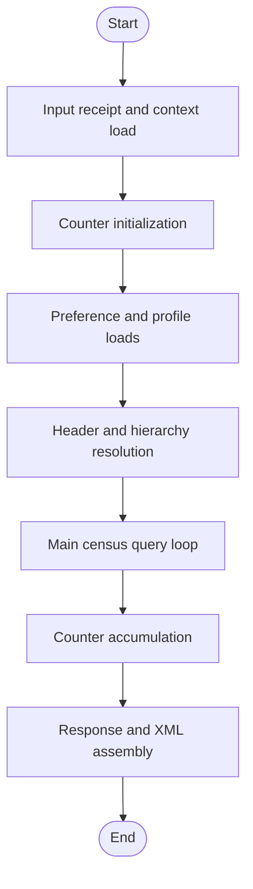
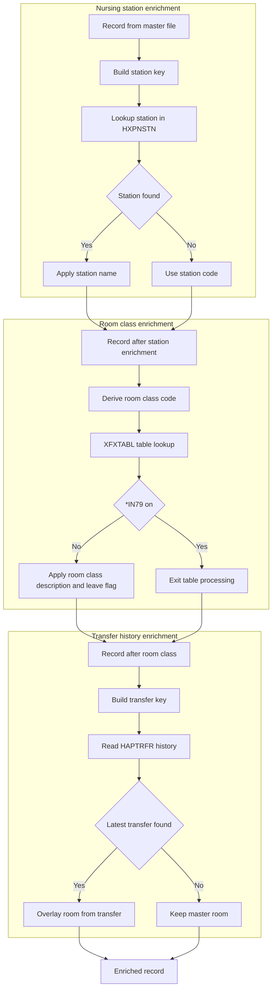
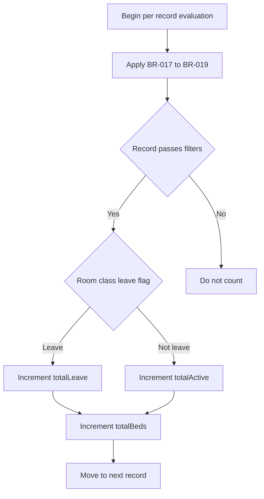
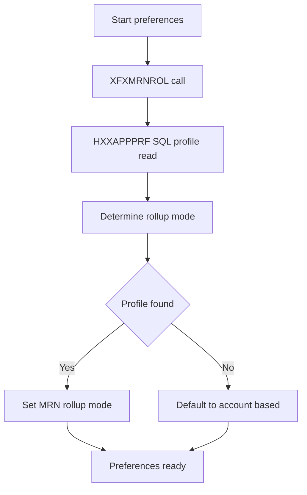
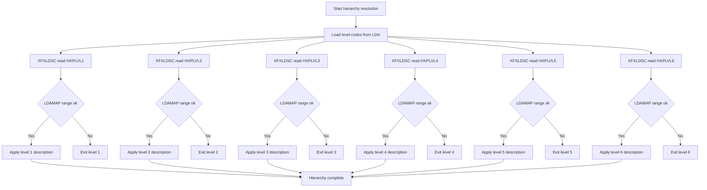
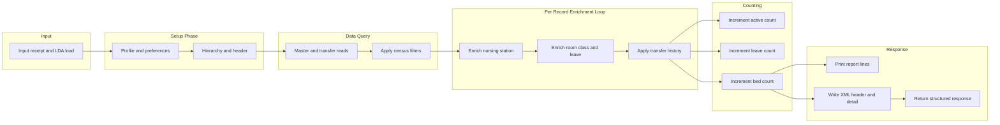

# Business Processing Flowchart - HABADTE Project

## 1. Top-Level Processing Flow



## 2. Record Filter Gate

```mermaid
flowchart TD
    START_FILTER([Start filter evaluation]) --> BR001{BR-001: X equals 0}
    BR001 -- "Exclude (EXIT)" --> EXIT1[Exit centering]
    BR001 -- "Include" --> BR002

    BR002{BR-002: X equals 40} -- "Exclude (EXIT)" --> EXIT2[Exit centering]
    BR002 -- "Include" --> BR003

    BR003{BR-003: VYY < 1800} -- "Exclude (EXIT)" --> EXIT3[Exit date routine]
    BR003 -- "Include" --> BR004

    BR004{BR-004: VYY > 2100} -- "Exclude (EXIT)" --> EXIT4[Exit date routine]
    BR004 -- "Include" --> BR005

    BR005{BR-005: VMM < 01} -- "Exclude (EXIT)" --> EXIT5[Exit date routine]
    BR005 -- "Include" --> BR006

    BR006{BR-006: VMM > 12} -- "Exclude (EXIT)" --> EXIT6[Exit date routine]
    BR006 -- "Include" --> BR007

    BR007{BR-007: VDD < 01} -- "Exclude (EXIT)" --> EXIT7[Exit date routine]
    BR007 -- "Include" --> BR008

    BR008{BR-008: VDD > DYS(VMM)} -- "Exclude (EXIT)" --> EXIT8[Exit date routine]
    BR008 -- "Include" --> FINAL_OK[Record passes date filters]

    FINAL_OK --> HAB017

    HAB017{BR-017: file indicator equals 0} -- "Exclude (SKIP)" --> SKIP1[Skip record]
    HAB017 -- "Include" --> HAB018

    HAB018{BR-018: flag indicator equals void} -- "Exclude (SKIP)" --> SKIP2[Skip record]
    HAB018 -- "Include" --> HAB019

    HAB019{BR-019: inpatient outpatient flag equals outpatient} -- "Exclude (SKIP)" --> SKIP3[Skip record]
    HAB019 -- "Include" --> CENSUS_OK[Record included in census]
```

## 3. Data Enrichment Flow



## 4. Counter and Aggregation Logic



## 5. Application Preference Lookup Flow



## 6. Org and Hierarchy Level Lookup Flow



## 7. End to End Summary Flow


