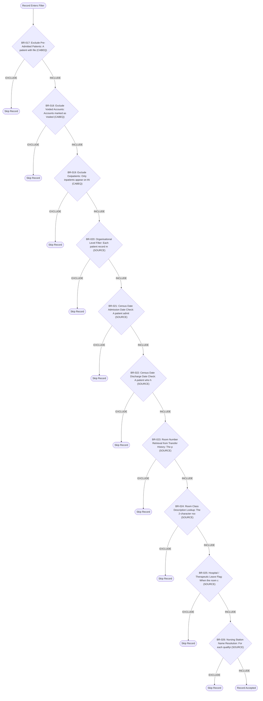
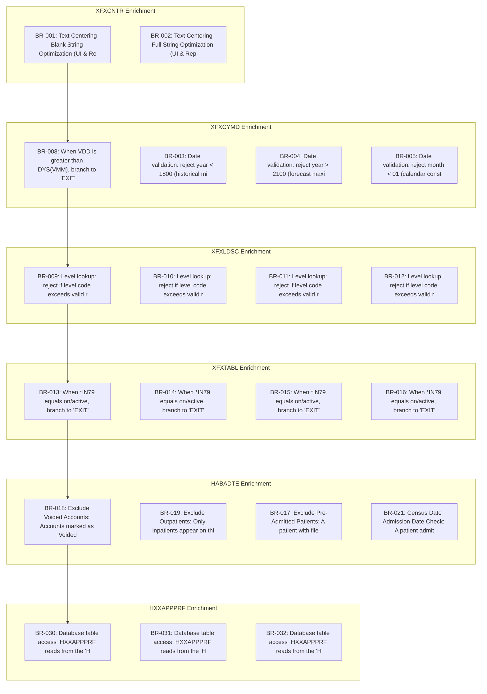
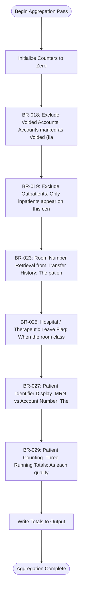
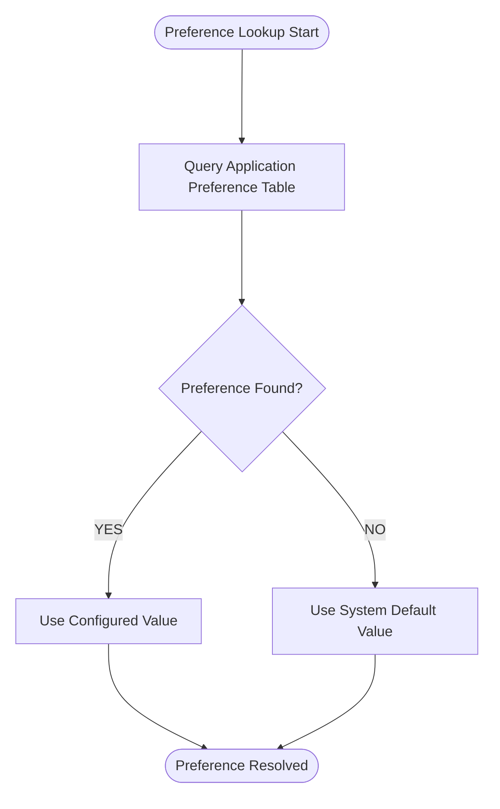
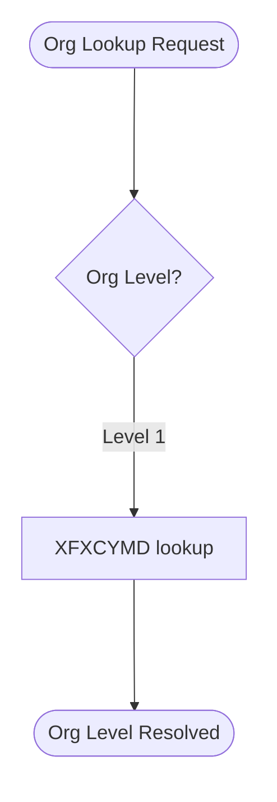

# Business Processing Flowchart

Auto-generated from pipeline artifacts. Covers all 7 processing phases.

## 1. Top-Level Processing Flow

End-to-end order of program execution, derived from Agent-2's program narratives (interpretations.json). Shows the overall request-to-response path.

```mermaid
%%{init: {"flowchart": {"nodeSpacing": 90, "rankSpacing": 120, "diagramPadding": 20}, "themeVariables": {"fontSize": "18px"}}}%%
flowchart TD
    START([START]) --> InputReceipt
    InputReceipt[Input Receipt and Validation]
    InputReceipt --> Step0
    Step0["XFXCNTR: RPGLE program in domain 'Data Maintenance'. Contains 2 rule("]
    Step0 --> Step1
    Step1["XFXCYMD: RPGLE program in domain 'Data Maintenance'. Contains 6 rule("]
    Step1 --> Step2
    Step2["XFXLDSC: RPGLE program in domain 'Data Maintenance'. Contains 4 rule("]
    Step2 --> Step3
    Step3["XFXTABL: RPGLE program in domain 'Data Maintenance'. Contains 4 rule("]
    Step3 --> Step4
    Step4["HABADTE: RPGLE program in domain 'Patient Management'. Contains 13 ru"]
    Step4 --> Step5
    Step5["HXXAPPPRF: SQLRPGLE program in domain 'Data Maintenance'. Contains 3 ru"]
    Step5 --> Step6
    Step6["XFXGETID: RPGLE program in domain 'Data Maintenance'. Cyclomatic compl"]
    Step6 --> Step7
    Step7["XFXLEAP: RPGLE program in domain 'Data Maintenance'. Cyclomatic compl"]
    Step7 --> Step8
    Step8["XFXMRNROL: RPGLE program in domain 'Data Maintenance'. Calls programs: "]
    Step8 --> END([END])
```

## 2. Record Filter Gate

Extracted CABEQ/CAB decision rules that decide whether a record is included or excluded from processing, in evaluation order.

## 3. Data Enrichment Flow

Per-program key business rules that enrich a record after it passes the filter gate, grouped by the program that applies them.

## 4. Counter and Aggregation Logic

Business rules that increment, sum, or tally values during processing (counters, totals, running sums), in the order they're applied.

## 5. Application Preference Lookup Flow

How a configurable setting is resolved at runtime: look up the preference table first, fall back to a system default if no entry is found.

## 6. Org and Hierarchy Level Lookup Flow

How a record is resolved to its organizational level (facility, department, region, etc.) — one branch per level the program checks.

## 7. End-to-End Summary Flow

One-page rollup of sections 1-6: input, setup (preferences + org lookup), query, per-record enrichment loop, and response assembly.

```mermaid
%%{init: {"flowchart": {"nodeSpacing": 90, "rankSpacing": 120, "diagramPadding": 20}, "themeVariables": {"fontSize": "18px"}}}%%
flowchart LR
    subgraph inp ["Input Phase"]
        INP[Receive Request Parameters]
    end
    subgraph setup ["Setup Phase"]
        PREF[Load Preferences]
        ORG[Resolve Org Hierarchy]
    end
    subgraph query ["Data Query"]
        QSQL[Execute Main SQL Query]
        FILT[Apply Record Filters]
    end
    subgraph enrich ["Per-Record Enrichment Loop"]
        ENRCH[Enrich Each Record]
        CNT[Update Counters]
    end
    subgraph resp ["Response"]
        ASMBL[Assemble Response]
        OUT[Return to Caller]
    end
    INP --> PREF
    PREF --> ORG
    ORG --> QSQL
    QSQL --> FILT
    FILT --> ENRCH
    ENRCH --> CNT
    CNT --> ASMBL
    ASMBL --> OUT
```

